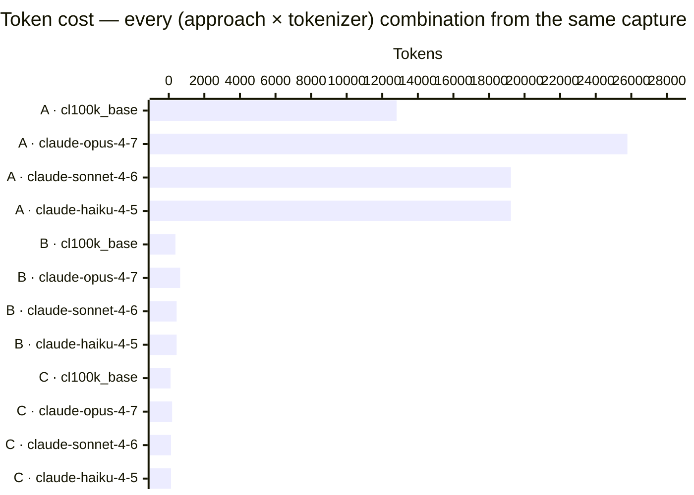

# kmp-test-runner

Standalone parallel test runner for Kotlin Multiplatform and Android Gradle projects.

## Why this exists — token cost per agent test-run iteration

For an AI coding agent re-running the suite on every change, the cheapest path matters. Same module, same failure, three observation strategies measured side-by-side ([methodology](docs/token-cost-measurement.md)):



Reading the chart: rows are the 12 (approach × tokenizer) combinations, bar length is tokens consumed. The four A rows dominate (raw gradle + reports); the four B rows and four C rows are the orders-of-magnitude smaller alternatives. Within each group of four, the cross-tokenizer variation is what the cross-model run validates. Same numbers in the table below:

| Tokenizer            | A. Raw gradle + reports | B. kmp-test parallel | C. kmp-test --json | A vs C  |
|----------------------|------------------------:|---------------------:|-------------------:|--------:|
| `cl100k_base`        |                  12,807 |                  376 |                101 |    127× |
| `claude-opus-4-7`    |              **25,780** |              **642** |            **187** | **138×**|
| `claude-sonnet-4-6`  |                  19,234 |                  444 |                125 |    154× |
| `claude-haiku-4-5`   |                  19,234 |                  444 |                125 |    154× |

The chart above uses `claude-opus-4-7` (the largest of the family — most pessimistic for the savings claim). The A:B:C ratio holds in a tight **127×–154× / 3.4×–3.7×** band across all four tokenizers — absolute counts vary by up to ±100% between tokenizers, but the relative order doesn't. Full per-model run output: [`tools/runs/cross-model-results.txt`](tools/runs/cross-model-results.txt).

> **Practical impact.** A 5-iteration agent loop on raw gradle burns ~128 K tokens just reading test reports — most of a 200 K context. Same loop on `--json` burns ~1 K. The agent's working memory stays focused on the code instead of log noise.

## Quick Start

**Linux / macOS**
```sh
curl -fsSL https://raw.githubusercontent.com/oscardlfr/kmp-test-runner/main/scripts/install.sh | bash
```

**Windows (PowerShell)**
```powershell
iwr -useb https://raw.githubusercontent.com/oscardlfr/kmp-test-runner/main/scripts/install.ps1 | iex
```

Or install via npm:
```sh
npm install -g kmp-test-runner
```

Then run:
```sh
kmp-test parallel --project-root /path/to/your/project
```

## Why kmp-test-runner

KMP projects mix JVM, Android, and native targets — each with its own Gradle task graph. Running them sequentially on CI blows past time budgets; running them naively in parallel hits file-lock contention on Windows and socket conflicts on emulators. kmp-test-runner wraps the right `maxParallelForks` and task-isolation defaults so your suite runs safely in parallel without custom scripting, whether you call it from npm, Gradle, or a shell one-liner.

It's also the testing piece that's missing from Google's [official `android` CLI for AI agents](https://developer.android.com/tools/agents/android-cli). That CLI (v0.7.x) covers project create/describe/deploy/emulator but ships no `test` subcommand — Google delegated test execution back to Gradle. `kmp-test --json` fills that gap with a single-line, parseable response that drops the agent-context cost from ~13 K tokens (raw Gradle + reports) to ~100 tokens. See "[Agentic usage](#agentic-usage--token-cost-rationale)" below for the measurement.

**Multi-agent safe (v0.3.8+).** When two `kmp-test` runs target the same project root — common with parallel agents or CI matrix shards — an advisory lockfile (`.kmp-test-runner.lock`) coordinates them and per-run-id-suffixed report files prevent clobber. The second arrival exits with a clear `lock_held` error (`--json` surfaces `errors[].code = "lock_held"`) instead of corrupting reports. Pass `--force` to override deliberately. See `docs/concurrency.md` for the full collision matrix.

## Installation

### Requirements

- Node.js 18+
- bash (Linux/macOS) or PowerShell 5.1+ (Windows)
- JDK 17+ and Gradle 8+ (Gradle plugin shape only)

### Option 1 — Shell installer (recommended)

**Linux / macOS**
```sh
curl -fsSL https://raw.githubusercontent.com/oscardlfr/kmp-test-runner/main/scripts/install.sh | bash
```

**Windows (PowerShell)**
```powershell
iwr -useb https://raw.githubusercontent.com/oscardlfr/kmp-test-runner/main/scripts/install.ps1 | iex
```

To uninstall:
```sh
# Linux/macOS
curl -fsSL https://raw.githubusercontent.com/oscardlfr/kmp-test-runner/main/scripts/uninstall.sh | bash

# Windows (PowerShell)
iwr -useb https://raw.githubusercontent.com/oscardlfr/kmp-test-runner/main/scripts/uninstall.ps1 | iex
```

### Option 2 — npm

```sh
npm install -g kmp-test-runner
```

Requires Node.js 18+. The npm package includes the CLI entry point and all platform scripts.

### Option 3 — Gradle plugin

Available on GitHub Packages. See the [Gradle Plugin](#gradle-plugin) section for setup.

## Usage

`--project-root` defaults to the current working directory, so the simplest invocation is:

```sh
cd /path/to/your/gradle/project
kmp-test parallel
```

Pass `--project-root <path>` explicitly when scripting from a different directory.

### Subcommands

| Subcommand | Description |
|-----------|-------------|
| `parallel` | Run all test targets in parallel with coverage |
| `changed` | Run tests only for modules changed since last commit |
| `android` | Run Android instrumented tests (requires connected device or emulator) |
| `benchmark` | Run benchmark suites with `Dispatchers.Default` for real contention |
| `coverage` | Generate coverage report only (skips test execution) |
| `doctor` | Diagnose the local environment (Node, bash/pwsh, gradlew, JDK, ADB) |

Each subcommand has its own `--help`:

```sh
kmp-test parallel --help    # parallel-specific flags + 1 example
kmp-test changed --help
kmp-test android --help
kmp-test benchmark --help
kmp-test coverage --help
kmp-test doctor --help
```

### Examples

```sh
# Run all tests in parallel with coverage (uses cwd as project root)
kmp-test parallel

# Same, against an explicit path
kmp-test parallel --project-root /path/to/project

# Run only changed modules (fast CI re-run)
kmp-test changed

# Run Android instrumented tests
kmp-test android --device emulator-5554

# Run benchmarks
kmp-test benchmark --config smoke

# Generate coverage report only (skip test run)
kmp-test coverage

# Agentic mode: emit a single JSON object on stdout (see "Agentic usage" below)
kmp-test parallel --json
```

### Exit codes

| Code | Meaning |
|------|---------|
| `0` | Success — all tests passed |
| `1` | Test failure — script ran, tests failed |
| `2` | Config error — bad CLI usage (unknown subcommand, missing arg) |
| `3` | Environment error — `gradlew` not found in `--project-root`, `bash`/`pwsh` missing on `PATH`, JDK absent |

### Flag reference

| Flag | Default | Description |
|------|---------|-------------|
| `--project-root` | `$PWD` | Path to the Gradle project root |
| `--max-workers` | `4` | Maximum parallel Gradle workers |
| `--coverage-tool` | `kover` | Coverage tool: `kover`, `jacoco`, or `none` |
| `--coverage-modules` | _(all)_ | Comma-separated module list for coverage aggregation |
| `--min-missed-lines` | `0` | Fail if missed lines exceed this threshold |
| `--shared-project-name` | _(none)_ | Name of the shared KMP module (for Android test dispatch) |
| `--json` / `--format json` | _(off)_ | Emit a single JSON object on stdout (see "Agentic usage" below). Suppresses human-readable output |

## Agentic usage — token-cost rationale

`kmp-test` is built to be cheap to call from AI coding agents. The `--json` flag is the lever: it replaces verbose, multi-step Gradle orchestration with a single command and a single structured response.

### Three ways an agent can run a KMP test suite

| Approach | What the agent does | What it consumes |
|----------|---------------------|------------------|
| **A. Raw Gradle + report parsing** | (1) Discover modules from `settings.gradle.kts`. (2) Build per-module `:module:test` task list. (3) Invoke `./gradlew :a:test :b:test ... --parallel --continue`. (4) Re-invoke `./gradlew koverXmlReport` (or jacoco). (5) Read each generated XML / HTML report from `build/reports/`. (6) Parse missed lines, failure stack frames, etc. | Tens of thousands of tokens of Gradle progress logs + multi-KB report files in context. The agent must also understand Gradle DSL, Kover/JaCoCo task names, and report XML schemas. |
| **B. `kmp-test` default mode** | (1) Run one command: `kmp-test parallel`. (2) Read the human-readable summary from stdout. | A few thousand tokens — the script does the orchestration and writes a compact markdown report, but progress output and the coverage report are still in the agent's context. |
| **C. `kmp-test --json` (agentic mode)** | (1) Run one command: `kmp-test parallel --json`. (2) `JSON.parse(stdout)`. | A few hundred tokens — a single JSON object with `tests`, `modules`, `coverage`, `errors`. No ANSI, no markdown, no Gradle log noise. |

### Side-by-side example

**Default (human) output** — the same summary block users see in CI logs (~1.5 KB shown, scaled down from a typical ~10–20 KB run):

```
Configuration:
  Project: my-app
  Test Type: all
  Modules found: 12
[>] Running tests for 12 modules in parallel...
> Task :core-foo:test ... 8 tests completed, 0 failed, 0 skipped
> Task :core-bar:test ... 5 tests completed, 0 failed, 0 skipped
... (one block per module) ...
[OK] Full coverage report generated!
[>>] Report saved to: coverage-full-report.md

Tests: 42 total | 42 passed | 0 failed | 0 skipped

======================================================================
  MODULE COVERAGE SUMMARY
======================================================================
core-foo                                          85.0%       12
core-bar                                          92.5%        4
... (one row per module) ...
TOTAL                                             88.0%       16
SUMMARY: 88.0% total | 16 lines missed | 3 modules at 100% | 1m 23s
BUILD SUCCESSFUL
```

**Agentic (`--json`) output** — the entire response, on one line:

```json
{"tool":"kmp-test","subcommand":"parallel","version":"0.3.8","project_root":"/abs/path","exit_code":0,"duration_ms":83000,"tests":{"total":42,"passed":42,"failed":0,"skipped":0},"modules":["core-foo","core-bar"],"coverage":{"tool":"kover","missed_lines":16},"errors":[]}
```

That's ~300 bytes — roughly **80–200 tokens** vs. tens of thousands for approach A. For an agent running tests on every iteration of a coding loop, the difference compounds quickly. The full per-tokenizer table is at the [top of this README](#why-this-exists--token-cost-per-agent-test-run-iteration); methodology and the captured run output are in [`docs/token-cost-measurement.md`](docs/token-cost-measurement.md).

### Why this gap matters

Google's [`android` CLI for agents](https://developer.android.com/tools/agents/android-cli) is the canonical agentic toolbelt for Android development — it has `create`, `describe`, `run`, `emulator`, `screen`, `layout`, `info`, `sdk`, and a pluggable `skills` system. It does **not** have a test command. An agent reaching for "the official tool" to run tests has to fall back to raw `./gradlew` invocations and parse multi-KB report files — exactly approach **A** above. `kmp-test --json` is the agent-friendly testing complement: same shape as `android describe` (single-line JSON, parseable, stable schema), focused on the test slice the official CLI doesn't cover.

### What the JSON guarantees

- **Always valid JSON**, even if parsing the script output partially fails. Parse gaps are surfaced in the `errors[]` array rather than crashing the CLI.
- **Stable schema**: `tool`, `subcommand`, `version`, `project_root`, `exit_code`, `duration_ms`, `tests {total/passed/failed/skipped}`, `modules[]`, `coverage {tool, missed_lines}`, `errors[]`.
- **Single line on stdout** — no surrounding noise, suitable for `JSON.parse()` directly.
- **Exit code matches `exit_code` field**, so an agent can branch on either.

## Agentic flags

`--json` is the headline flag, but four agentic levers ship together so you can introspect, scope, and validate without paying full test-execution cost.

### `--dry-run` — what would run, no spawn

```sh
kmp-test parallel --dry-run --project-root /abs/path
# kmp-test parallel — DRY RUN (no script invoked)
#   Project root: /abs/path
#   Subcommand:   parallel
#   Script:       /abs/path/to/run-parallel-coverage-suite.sh
#   Final argv:   --project-root /abs/path
#   Spawn:        bash /abs/path/to/run-parallel-coverage-suite.sh --project-root /abs/path
```

Pair with `--json` for a structured plan:

```json
{"tool":"kmp-test","subcommand":"parallel","version":"0.3.8","dry_run":true,"exit_code":0,"plan":{"spawn_cmd":"bash","spawn_args":["…/run-parallel-coverage-suite.sh","--project-root","/abs"],"script_path":"…/run-parallel-coverage-suite.sh","final_args":["--project-root","/abs"],"test_filter":null},…}
```

`--dry-run` still validates `gradlew` (so a missing wrapper still exits `3`). It just stops before spawning the script.

### `--test-filter <pattern>` — single-class scope

Cuts a multi-module suite down to one test class without forcing the agent to bypass the CLI:

```sh
# JVM gradle tasks — gradle's --tests handles globs natively
kmp-test parallel --test-filter "*FooServiceTest"

# Android instrumented — CLI resolves *Pattern* to FQN by source scan
# (the Android runner doesn't accept wildcards, so this resolution is required)
kmp-test android --test-filter "*WidgetTest*"

# Benchmark — same translation, per-platform
kmp-test benchmark --platform android --test-filter "*ScaleBenchmark*"
```

When the pattern contains `*`, the CLI walks the project sources (skipping `build/`, `.gradle/`, `node_modules/`, `.git/`) for a `class <stripped>` declaration and substitutes the FQN. If no match is found, the original pattern is forwarded — gradle/Android then surfaces a clear error rather than the CLI guessing.

### `kmp-test doctor` — environment diagnosis

Five quick checks that catch the usual "why isn't this running" suspects:

```sh
kmp-test doctor
# CHECK    STATUS  VALUE      MESSAGE
# Node     OK      v22.5.0    >=18 required
# bash     OK      available  shell present
# gradlew  OK      present    /path/to/project
# JDK      OK      17.0.10    >=17 recommended
# ADB      WARN    not found  install Android SDK platform-tools to run android subcommand
```

Exit `0` if every check is OK or WARN; exit `3` if any FAIL (Node <18, missing shell, missing JDK). `--json` emits the same data as a structured array for agents:

```json
{"tool":"kmp-test","subcommand":"doctor","exit_code":0,"checks":[{"name":"Node","status":"OK","value":"v22.5.0","message":">=18 required"},…]}
```

### Composing them

```sh
# Show the plan an agent would execute, in JSON, with the test-filter resolved:
kmp-test benchmark --platform android --test-filter "*ScaleBenchmark*" --dry-run --json

# Confirm the box can run kmp-test before queueing a real run:
kmp-test doctor --json | jq '.checks[] | select(.status == "FAIL")'
```

## Gradle Plugin

`io.github.oscardlfr.kmp-test-runner` is the Gradle consumer shape. It registers 5 Gradle tasks that mirror the npm subcommands and dispatch to the same platform scripts.

### Setup (consumer side)

In `settings.gradle.kts`:
```kotlin
pluginManagement {
    repositories {
        gradlePluginPortal()
        maven {
            url = uri("https://maven.pkg.github.com/oscardlfr/kmp-test-runner")
            credentials {
                username = providers.gradleProperty("gpr.user").orNull
                    ?: System.getenv("GITHUB_ACTOR")
                password = providers.gradleProperty("gpr.key").orNull
                    ?: System.getenv("GITHUB_TOKEN")
            }
        }
    }
}
```

In `build.gradle.kts`:
```kotlin
plugins {
    id("io.github.oscardlfr.kmp-test-runner") version "0.3.7"
}

kmpTestRunner {
    projectRoot = rootDir.absolutePath
    maxWorkers = 4
    coverageTool = "kover"           // "kover" | "jacoco" | "none"
    coverageModules = ":core,:app"
    minMissedLines = 0
    sharedProjectName = "my-shared-lib"
}
```

### Tasks

| Task | Subcommand | Underlying script |
|------|-----------|-------------------|
| `parallelTests` | `kmp-test parallel` | `run-parallel-coverage-suite.sh` |
| `changedTests` | `kmp-test changed` | `run-changed-modules-tests.sh` |
| `androidTests` | `kmp-test android` | `run-android-tests.sh` |
| `benchmarkTests` | `kmp-test benchmark` | `run-benchmarks.sh` |
| `coverageTask` | `kmp-test coverage` | `run-parallel-coverage-suite.sh --skip-tests` |

### Authentication (consumer side)

Add to `~/.gradle/gradle.properties` (NOT to a checked-in file):
```properties
gpr.user=<your-github-username>
gpr.key=<github-personal-access-token-with-read:packages-scope>
```

A token with `read:packages` scope is sufficient for consumers. Maven Central will be the recommended channel from v0.4.0 onward (no auth needed).

## Configuration

### npm CLI flags

| Flag | Default | Description |
|------|---------|-------------|
| `--project-root` | `$PWD` | Path to the Gradle project root |
| `--max-workers` | `4` | Maximum parallel Gradle workers |
| `--coverage-tool` | `kover` | `kover` \| `jacoco` \| `none` |
| `--coverage-modules` | _(all)_ | Comma-separated module names for coverage |
| `--min-missed-lines` | `0` | Fail threshold for missed lines |
| `--shared-project-name` | _(none)_ | Shared KMP module name |

### Gradle DSL properties

| Property | Type | Default | Description |
|----------|------|---------|-------------|
| `projectRoot` | `String` | `rootDir.absolutePath` | Gradle project root path |
| `maxWorkers` | `Int` | `4` | Parallel Gradle workers |
| `coverageTool` | `String` | `"kover"` | `"kover"` \| `"jacoco"` \| `"none"` |
| `coverageModules` | `String` | _(all)_ | Colon-prefixed module list (e.g. `":core,:app"`) |
| `minMissedLines` | `Int` | `0` | Fail threshold for missed lines |
| `sharedProjectName` | `String` | _(none)_ | Shared KMP module name |

## Architecture

kmp-test-runner uses a three-shape model: an npm CLI, a Gradle plugin, and shell installers — all backed by the same set of platform scripts in `scripts/sh/`. The npm CLI and Gradle plugin map subcommands and DSL properties to identical script invocations, ensuring cross-shape parity. `CrossShapeParityTest` enforces this structurally in CI — it asserts that every npm subcommand flag has a matching Gradle task name without spawning a subprocess. This design lets the runner be consumed as a global tool (installer), a project devDependency (npm), or a Gradle task (plugin) with no behavioral difference.

## Contributing

Open issues and pull requests are welcome. Please run `npm test` (Vitest + bats + shellcheck) and `./gradlew test` (Gradle TestKit) locally before submitting a PR. A `CONTRIBUTING.md` with full contributor guide is planned for v0.4.0.

## License

Apache-2.0 — see [LICENSE](LICENSE) for details.

## Changelog

See [CHANGELOG.md](CHANGELOG.md) for version history.
