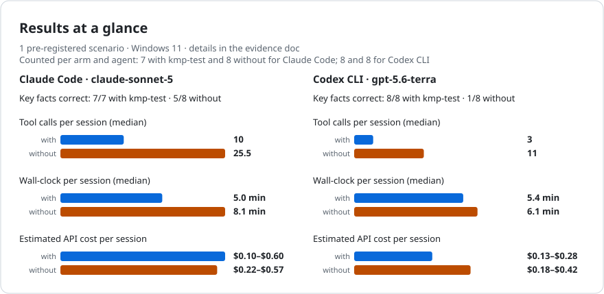
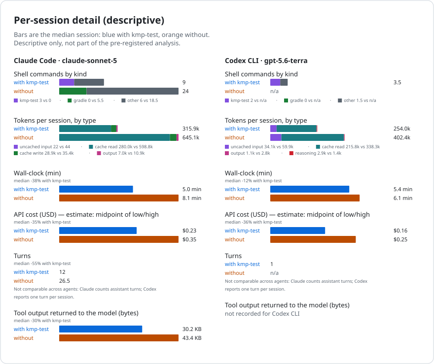
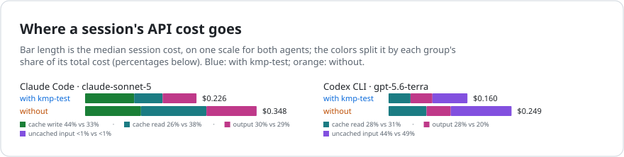
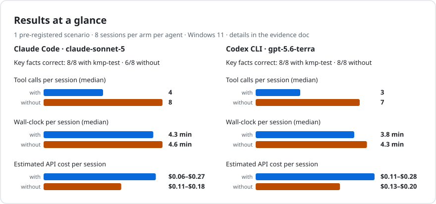
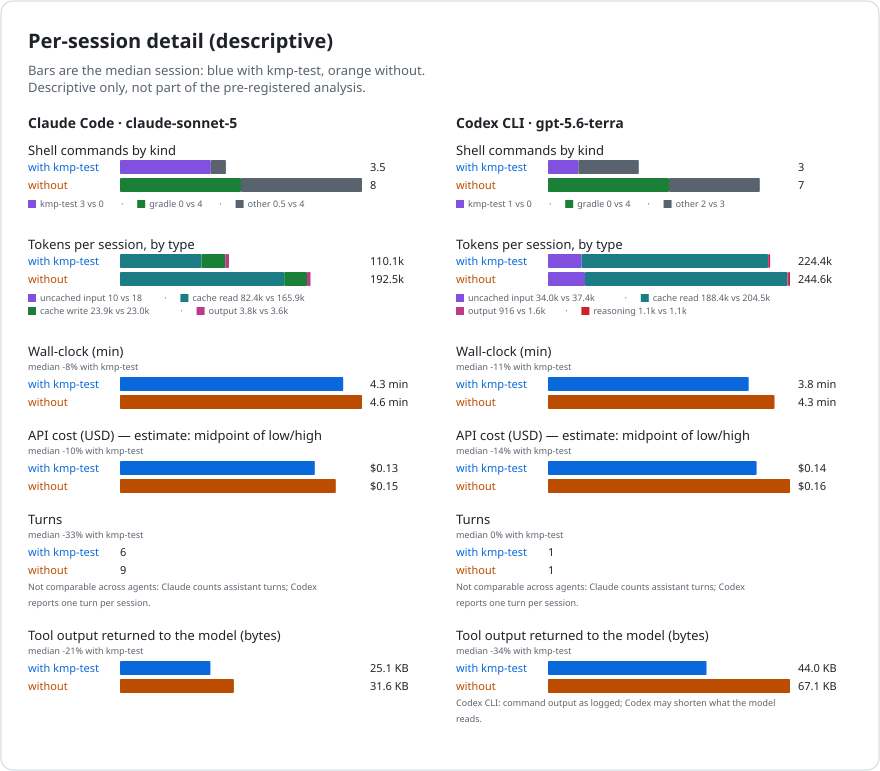
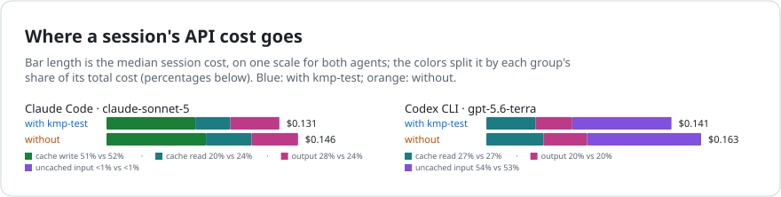

# Agentic benchmark: detailed results

This page explains the agentic benchmark behind the numbers in the README. The method is in
[agentic-usage-measurement.md](agentic-usage-measurement.md). Each campaign's record (preregistration,
controls audit, per-session tables, errata) is linked from its section below.

## What is measured

Each session gives a coding agent one realistic testing task on a real open-source project, and records
everything the agent does. Two arms differ in one thing only:
- in the **with kmp-test** arm, the agent can use the `kmp-test` CLI and its Agent Skill;
- in the **without** arm, it cannot, and works with Gradle directly.

Both arms get the same prompt, project checkout, model and settings, and they alternate in a
preregistered order.

For every session the harness records:
- whether the final answer's key facts match the ground truth;
- wall-clock time;
- tool calls, and shell commands by kind;
- model turns;
- tokens by type;
- the bytes of tool output. For Claude Code these are the tool results returned to the model. For Codex
  CLI they are the output of the commands it ran, as logged; Codex may shorten what the model reads.
  Codex CLI's tool output was not measured in Evidence2.
- an API cost estimated from the tokens at published list prices.

<!-- agentic-benchmark-overview:start (generated by tools/agentic-eval/readme-evidence.mjs --overview from tools/runs/agentic-benchmark-campaigns.json; do not edit) -->
![Median per session with kmp-test vs without, one block per scenario, bars on one scale per column. 1 module · run its tests, check a coverage budget (Evidence2): Claude Code: 4.5 vs 13 tool calls, $0.112 vs $0.183, 3.5 min vs 3.8 min, key facts 4/4 vs 4/4; Codex CLI: 3 vs 13 tool calls, $0.108 vs $0.212, 4.5 min vs 4.7 min, key facts 4/4 vs 4/4. 11 modules · find the 6 failing tests (Evidence3): Claude Code: 3 vs 12 tool calls, $0.110 vs $0.210, 4.0 min vs 3.8 min, key facts 7/8 vs 7/7; Codex CLI: 4 vs 20 tool calls, $0.145 vs $0.288, 4.0 min vs 5.0 min, key facts 7/8 vs 7/7. 11 modules · measure LINE coverage per module (Evidence4): Claude Code: 10 vs 25.5 tool calls, $0.226 vs $0.348, 5.0 min vs 8.1 min, key facts 7/7 vs 5/8; Codex CLI: 3 vs 11 tool calls, $0.160 vs $0.249, 5.4 min vs 6.1 min, key facts 8/8 vs 1/8. 19 selected modules · changed dependencies and a downstream failure (Evidence5): Claude Code: 11 vs 22.5 tool calls, $0.219 vs $0.358, 6.8 min vs 6.8 min, key facts 4/7 vs 0/6; Codex CLI: 5 vs 17.5 tool calls, $0.197 vs $0.330, 6.7 min vs 7.7 min, key facts 8/8 vs 0/8. 11 modules · identify a compile failure and unrun dependents (Evidence6): Claude Code: 4 vs 8 tool calls, $0.131 vs $0.146, 4.3 min vs 4.6 min, key facts 8/8 vs 6/8; Codex CLI: 3 vs 7 tool calls, $0.141 vs $0.163, 3.8 min vs 4.3 min, key facts 8/8 vs 8/8.](../tools/runs/agentic-benchmark-overview.svg)
<!-- agentic-benchmark-overview:end -->

## Evidence2 (2026-09-30): one module, coverage threshold

Scenario: in NowInAndroid, find the business-logic module (`:core:domain`, 2 test methods), run its
tests and check a coverage budget. 16 sessions: Claude Code (claude-sonnet-5) and Codex CLI
(gpt-5.6-terra), 4 per agent and arm. Record: [Evidence2](../tools/runs/evidence2-agentic-benchmark-2026-09-30/README.md).

### Where the cost goes

<!-- agentic-benchmark-doc:e2-cost-components:start (generated by tools/agentic-eval/benchmark-doc.mjs; do not edit) -->
Median cost per session by component (USD, estimated at list prices)

| Agent and arm | cache write | cache read | output | uncached input | median session total | sessions |
|---|---:|---:|---:|---:|---:|---:|
| Claude Code with kmp-test | 0.073 | 0.023 | 0.018 | 0.000 | 0.112 | 4 |
| Claude Code without | 0.087 | 0.060 | 0.037 | 0.000 | 0.183 | 4 |
| Codex CLI with kmp-test | — | 0.033 | 0.029 | 0.048 | 0.108 | 4 |
| Codex CLI without | — | 0.077 | 0.050 | 0.084 | 0.212 | 4 |

Component medians are taken separately, so they need not add up to the median total.
<!-- agentic-benchmark-doc:e2-cost-components:end -->

Most of a session's tokens are the agent's own context going through the prompt cache. The system
prompt, tool definitions, task and conversation so far are written to the cache once, then read back on
every later model request. Cache reads are billed at a tenth of the input price, so the extra requests a
session makes cost it mostly cheap re-reads.

That is why the difference between the arms is modest in this scenario. With kmp-test the agents made
far fewer tool calls, so they re-read less context and wrote fewer output tokens; those two components
account for most of the saving. For Claude Code, cache writes change much less between the arms than
cache reads.

The task is deliberately small: for Claude Code, the tool output returned to the model differed between
the arms by kilobytes, not megabytes. Codex CLI's tool output was not measured in this campaign
(Errata E6). kmp-test's advantage in output volume grows with project size. In the
[token-cost measurement](token-cost-measurement.md), one `parallel` run over NowInAndroid (36 modules as
counted there) produced 226,291 tokens of raw Gradle output against 1,839 through
`kmp-test parallel --json` (same project and capture).

### Every session

<!-- agentic-benchmark-doc:e2-sessions:start (generated by tools/agentic-eval/benchmark-doc.mjs; do not edit) -->
| Agent | Arm | Round | Key facts | Full answer | Wall-clock (min) | Tool calls | Shell kmp-test/Gradle/other | Turns | uncached input | cache read | cache write | output | reasoning | Tool output (KB) | Est. cost (USD) |
|---|---|---:|---|---|---:|---:|---:|---:|---:|---:|---:|---:|---:|---:|---:|
| Claude Code | with kmp-test | 0 | yes | yes | 3.5 | 6 | 5/0/0 | 8 | 14 | 150,102 | 20,487 | 2,077 | — | 10.4 | 0.117 |
| Claude Code | without | 1 | yes | no | 3.9 | 11 | 0/4/7 | 12 | 24 | 247,484 | 26,063 | 2,848 | — | 29.5 | 0.163 |
| Claude Code | without | 2 | yes | no | 3.8 | 15 | 0/3/12 | 16 | 30 | 385,398 | 28,350 | 4,638 | — | 33.0 | 0.216 |
| Claude Code | with kmp-test | 3 | yes | yes | 3.5 | 3 | 2/0/0 | 5 | 8 | 76,828 | 23,048 | 1,191 | — | 18.4 | 0.102 |
| Claude Code | without | 4 | yes | no | 4.0 | 11 | 0/4/7 | 12 | 24 | 256,773 | 25,730 | 3,067 | — | 29.2 | 0.166 |
| Claude Code | with kmp-test | 5 | yes | yes | 3.2 | 3 | 2/0/0 | 5 | 8 | 76,860 | 23,292 | 1,459 | — | 18.4 | 0.106 |
| Claude Code | with kmp-test | 6 | yes | yes | 4.1 | 15 | 3/0/11 | 17 | 32 | 376,942 | 22,083 | 3,664 | — | 8.8 | 0.184 |
| Claude Code | without | 7 | yes | no | 3.7 | 15 | 0/3/12 | 16 | 32 | 345,019 | 27,463 | 4,280 | — | 31.5 | 0.201 |
| Codex CLI | with kmp-test | 0 | yes | yes | 5.2 | 3 | 3/0/0 | 1 | 21,763 | 179,712 | — | 833 | 1,765 | — | 0.116 |
| Codex CLI | without | 1 | yes | no | 3.6 | 9 | 0/2/7 | 1 | 32,987 | 264,960 | — | 1,962 | 909 | — | 0.162 |
| Codex CLI | without | 2 | yes | no | 5.9 | 17 | 0/3/14 | 1 | 41,918 | 504,320 | — | 3,817 | 1,696 | — | 0.261 |
| Codex CLI | with kmp-test | 3 | yes | yes | 6.9 | 16 | 4/0/12 | 1 | 30,337 | 364,288 | — | 2,435 | 3,126 | — | 0.208 |
| Codex CLI | without | 4 | yes | no | 5.6 | 23 | 0/1/22 | 1 | 48,694 | 599,040 | — | 4,159 | 1,301 | — | 0.295 |
| Codex CLI | with kmp-test | 5 | yes | yes | 3.7 | 3 | 3/0/0 | 1 | 20,671 | 152,576 | — | 693 | 716 | — | 0.094 |
| Codex CLI | with kmp-test | 6 | yes | yes | 3.5 | 3 | 3/0/0 | 1 | 20,147 | 147,456 | — | 721 | 1,435 | — | 0.101 |
| Codex CLI | without | 7 | yes | no | 3.7 | 7 | 0/2/5 | 1 | 28,410 | 194,048 | — | 1,583 | 966 | — | 0.133 |
<!-- agentic-benchmark-doc:e2-sessions:end -->

### Session conditions

Every session started from the same state:
- a fresh git worktree of the pinned NowInAndroid commit;
- a fresh copy of the same offline Gradle cache, with Gradle daemons and the configuration cache
  disabled;
- a fresh temporary directory, and a process job that ends every process the agent started;
- no session history: Claude Code ran with `--no-session-persistence`, and Codex CLI with `--ephemeral`
  and without user configuration or rules.

Shared across sessions: the agents' login directories, the providers' server-side prompt caches, and the
evaluation VM itself. The record's [Errata](../tools/runs/evidence2-agentic-benchmark-2026-09-30/README.md#errata)
list what an audit of the raw transcripts found, including that Claude Code's auto memory was enabled
and shared.

### Cost method

Costs are estimates: tokens multiplied by the providers' published list prices, recorded with their
source and retrieval date in [cost-estimate.json](../tools/runs/evidence2-agentic-benchmark-2026-09-30/cost-estimate.json).
They are not billed amounts.

Claude Code prints its own `total_cost_usd`, but it computes that on the client from a price table
bundled with the CLI. The CLI version used here priced this model 1.5x above its published rates
(Errata E1). Codex CLI reports no cost.

## Evidence3 (2026-10-02): many modules, failing tests

<!-- agentic-benchmark-doc:e3-scenario:start (generated by tools/agentic-eval/benchmark-doc.mjs; do not edit) -->
**Scenario:** in NowInAndroid, a small production-code change breaks tests in several modules. The agent runs the unit tests of every module except those whose Robolectric tests need network access, then reports which modules and test classes fail and how many tests. 11 modules are in scope, with 6 failing test methods.
<!-- agentic-benchmark-doc:e3-scenario:end -->

<!-- agentic-benchmark-doc:e3-run:start (generated by tools/agentic-eval/benchmark-doc.mjs; do not edit) -->
**Sessions:** 32 run, 30 counted; per agent and arm: 8 with kmp-test and 7 without for Claude Code; 8 and 7 for Codex CLI. Claude Code (claude-sonnet-5) and Codex CLI (gpt-5.6-terra), in a counterbalanced order. This is the campaign's second attempt; the first failed on infrastructure and is not analyzed (preregistration amendment A4). Two sessions are missing data and are not counted: one was rejected by the harness, one was lost to a failed call into the guest VM (amendment A5 treats such a loss like a rejection); none of them was re-run or replaced. Record: [Evidence3](../tools/runs/evidence3-agentic-benchmark-2026-10-02/README.md).
<!-- agentic-benchmark-doc:e3-run:end -->

### Where the cost goes

<!-- agentic-benchmark-doc:e3-cost-components:start (generated by tools/agentic-eval/benchmark-doc.mjs; do not edit) -->
Median cost per session by component (USD, estimated at list prices)

| Agent and arm | cache write | cache read | output | uncached input | median session total | sessions |
|---|---:|---:|---:|---:|---:|---:|
| Claude Code with kmp-test | 0.072 | 0.013 | 0.026 | 0.000 | 0.110 | 8 |
| Claude Code without | 0.091 | 0.052 | 0.069 | 0.000 | 0.210 | 7 |
| Codex CLI with kmp-test | — | 0.050 | 0.027 | 0.070 | 0.145 | 8 |
| Codex CLI without | — | 0.101 | 0.066 | 0.127 | 0.288 | 7 |

Component medians are taken separately, so they need not add up to the median total.
<!-- agentic-benchmark-doc:e3-cost-components:end -->

### Every session

<!-- agentic-benchmark-doc:e3-sessions:start (generated by tools/agentic-eval/benchmark-doc.mjs; do not edit) -->
| Agent | Arm | Round | Key facts | Full answer | Wall-clock (min) | Tool calls | Shell kmp-test/Gradle/other | Turns | uncached input | cache read | cache write | output | reasoning | Tool output (KB) | Est. cost (USD) |
|---|---|---:|---|---|---:|---:|---:|---:|---:|---:|---:|---:|---:|---:|---:|
| Claude Code | with kmp-test | 0 | yes | yes | 4.2 | 5 | 2/0/2 | 7 | 12 | 113,489 | 25,892 | 5,896 | — | 26.6 | 0.166 |
| Claude Code | without | 1 | yes | yes | 3.3 | 11 | 0/1/10 | 12 | 24 | 215,146 | 25,442 | 5,535 | — | 35.6 | 0.181 |
| Claude Code | without | 2 | yes | yes | 4.1 | 6 | 0/2/4 | 7 | 14 | 127,641 | 28,532 | 5,523 | — | 40.1 | 0.174 |
| Claude Code | with kmp-test | 3 | yes | yes | 4.3 | 3 | 1/0/1 | 5 | 8 | 63,299 | 21,468 | 2,997 | — | 25.3 | 0.112 |
| Claude Code | without | 4 | yes | yes | 2.8 | 12 | 0/1/11 | 13 | 26 | 259,229 | 27,364 | 6,949 | — | 35.6 | 0.210 |
| Claude Code | with kmp-test | 5 | yes | yes | 3.6 | 3 | 1/0/1 | 5 | 8 | 63,282 | 21,779 | 1,900 | — | 25.3 | 0.102 |
| Claude Code | with kmp-test | 6 | yes | yes | 4.7 | 4 | 2/0/1 | 6 | 10 | 92,954 | 27,764 | 3,258 | — | 35.4 | 0.141 |
| Claude Code | without | 7 | yes | yes | 5.1 | 14 | 0/3/11 | 15 | 30 | 347,526 | 27,980 | 7,638 | — | 34.4 | 0.237 |
| Claude Code | with kmp-test | 9 | yes | yes | 3.4 | 3 | 1/0/1 | 5 | 8 | 63,423 | 22,116 | 2,242 | — | 25.3 | 0.107 |
| Claude Code | with kmp-test | 10 | yes | yes | 5.2 | 6 | 2/0/3 | 8 | 14 | 153,443 | 27,049 | 3,211 | — | 34.3 | 0.151 |
| Claude Code | without | 11 | yes | yes | 8.3 | 15 | 0/2/13 | 16 | 32 | 343,321 | 30,374 | 7,300 | — | 39.0 | 0.240 |
| Claude Code | with kmp-test | 12 | no | no | 3.5 | 3 | 1/0/1 | 5 | 8 | 63,383 | 21,567 | 1,735 | — | 25.3 | 0.100 |
| Claude Code | without | 13 | yes | yes | 3.8 | 8 | 0/1/7 | 9 | 18 | 160,562 | 27,352 | 5,353 | — | 38.2 | 0.175 |
| Claude Code | without | 14 | yes | yes | 3.8 | 16 | 0/3/13 | 17 | 34 | 385,256 | 31,840 | 8,196 | — | 41.0 | 0.263 |
| Claude Code | with kmp-test | 15 | yes | yes | 3.8 | 3 | 1/0/1 | 5 | 8 | 63,363 | 22,023 | 2,291 | — | 25.3 | 0.107 |
| Codex CLI | with kmp-test | 0 | yes | yes | 4.9 | 11 | 4/0/7 | 1 | 34,216 | 374,016 | — | 2,087 | 2,773 | 67.5 | 0.210 |
| Codex CLI | without | 1 | yes | yes | 5.0 | 13 | 0/6/7 | 1 | 56,137 | 395,264 | — | 2,010 | 2,759 | 120.5 | 0.263 |
| Codex CLI | without | 2 | yes | yes | 4.5 | 20 | 0/3/17 | 1 | 40,568 | 462,592 | — | 3,258 | 2,221 | 72.2 | 0.250 |
| Codex CLI | with kmp-test | 3 | yes | yes | 3.9 | 4 | 2/0/2 | 1 | 32,898 | 249,088 | — | 1,017 | 1,197 | 60.8 | 0.150 |
| Codex CLI | without | 4 | yes | yes | 6.4 | 20 | 0/4/16 | 1 | 59,784 | 674,560 | — | 4,594 | 3,325 | 138.6 | 0.364 |
| Codex CLI | with kmp-test | 5 | yes | yes | 4.0 | 3 | 2/0/1 | 1 | 27,850 | 229,888 | — | 995 | 1,345 | 48.5 | 0.137 |
| Codex CLI | with kmp-test | 6 | yes | yes | 4.8 | 9 | 4/0/5 | 1 | 32,783 | 324,352 | — | 1,698 | 3,316 | 68.3 | 0.199 |
| Codex CLI | without | 8 | yes | yes | 4.3 | 8 | 0/5/3 | 1 | 55,226 | 359,168 | — | 1,691 | 1,076 | 171.4 | 0.229 |
| Codex CLI | with kmp-test | 9 | yes | yes | 4.5 | 10 | 4/0/6 | 1 | 33,142 | 361,728 | — | 1,618 | 1,169 | 68.5 | 0.180 |
| Codex CLI | with kmp-test | 10 | yes | yes | 3.8 | 4 | 2/0/2 | 1 | 28,996 | 248,064 | — | 1,201 | 793 | 48.4 | 0.139 |
| Codex CLI | without | 11 | yes | yes | 4.9 | 15 | 0/5/10 | 1 | 56,249 | 506,112 | — | 3,320 | 1,737 | 124.4 | 0.288 |
| Codex CLI | with kmp-test | 12 | no | no | 3.8 | 4 | 2/0/2 | 1 | 26,970 | 227,840 | — | 1,017 | 1,198 | 48.4 | 0.133 |
| Codex CLI | without | 13 | yes | yes | 6.7 | 25 | 0/8/17 | 1 | 56,986 | 731,648 | — | 5,397 | 2,992 | 134.9 | 0.375 |
| Codex CLI | without | 14 | yes | yes | 6.7 | 22 | 0/3/19 | 1 | 81,702 | 644,608 | — | 4,433 | 2,617 | 137.4 | 0.397 |
| Codex CLI | with kmp-test | 15 | yes | yes | 3.6 | 3 | 2/0/1 | 1 | 27,244 | 204,544 | — | 1,048 | 846 | 48.4 | 0.125 |

Two sessions are not in the table because they are missing data: Claude Code without, round 8 (`rejected_not_reclassifiable`: the harness rejected the session); Codex CLI without, round 7 (`cell_directory_absent`: no session evidence was recorded). The record's controls audit has the details.
<!-- agentic-benchmark-doc:e3-sessions:end -->

### Why two sessions missed the key facts

Both misses are in round 12 of the kmp-test arm, one per agent. Each named the right modules and test
classes and got the failing-test count wrong.

- **Claude Code answered 7.** It ran `kmp-test parallel --variant demoDebug` without `--flavor`.
  `--variant` takes `auto`, `debug`, `release` or `all`, so `demoDebug` was not recognized. On this
  project, whose modules declare the demo and prod flavors, kmp-test then runs each module's umbrella
  `test` task, which runs the unit tests of both flavors, so each of the 6 failing tests appeared twice
  in the output. kmp-test gave no warning: its warning for this fallback is not emitted for the default
  test type. Claude Code also shortened the long output it returned to the model. In rounds 3 and 10
  Claude Code made the same call, saw the same doubled output and answered 6; in round 6 it made the
  same call and then ran again with `--flavor demo --variant debug`.
- **Codex CLI answered 5.** It ran `kmp-test parallel --flavor demo --variant debug`, and kmp-test's
  output listed exactly the 6 failing tests: one in `:core:data`, two in `:core:domain` and three in
  `:feature:bookmarks:impl`.

kmp-test's summary gives the number of failing test tasks (3) and the total number of tests (93), but
not the number of failing tests, so an agent has to count the listed failures. The follow-ups are in
the [backlog](../BACKLOG.md).

### Session conditions

Same as in Evidence2, with these additions:
- Claude Code ran with auto memory disabled, non-essential traffic and telemetry off, and a
  30-minute Bash timeout.
- For Codex CLI, tool output is now the output of the commands it ran, as logged. Codex may shorten what
  the model reads. For Claude Code, tool output is still the tool results returned to the model.
- The agents' configuration directories were listed (names, sizes and times only) before and after every session. No session changed a file that a later session would load. Codex CLI rewrote its `config.toml` (same size, new modification time) at the start of every session; the harness starts Codex CLI with `--ignore-user-config`, which skips that file, so `agent_state_clean` is false for those cells in the summary and the record names them. Codex CLI also updates SQLite state files in its home; their contents are not verified.
- The transcripts of 30 of the 32 sessions were scanned for the ground-truth, preregistration and private
  paths, with no hits. The two sessions that are missing data left no transcript, so access is not
  verified for them.

Details are in the record's controls audit.

## Evidence4 (2026-10-07): LINE coverage by module

<!-- agentic-benchmark-doc:e4-scenario:start (generated by tools/agentic-eval/benchmark-doc.mjs; do not edit) -->
**Scenario:** in NowInAndroid, the agent runs unit tests and measures LINE coverage separately for 11 in-scope modules. It reports which modules fall below the 26% threshold and which have no coverage data.
<!-- agentic-benchmark-doc:e4-scenario:end -->

<!-- agentic-benchmark-doc:e4-run:start (generated by tools/agentic-eval/benchmark-doc.mjs; do not edit) -->
**Sessions:** 32 run, 31 counted; per agent and arm: 7 with kmp-test and 8 without for Claude Code; 8 and 8 for Codex CLI. Claude Code (claude-sonnet-5) and Codex CLI (gpt-5.6-terra), in a counterbalanced order. One session is missing data and is not counted; it was not replaced. Record: [Evidence4](../tools/runs/evidence4-agentic-benchmark-2026-10-07/README.md).
<!-- agentic-benchmark-doc:e4-run:end -->

### Where the cost goes

<!-- agentic-benchmark-doc:e4-cost-components:start (generated by tools/agentic-eval/benchmark-doc.mjs; do not edit) -->
Median cost per session by component (USD, estimated at list prices)

| Agent and arm | cache write | cache read | output | uncached input | median session total | sessions |
|---|---:|---:|---:|---:|---:|---:|
| Claude Code with kmp-test | 0.094 | 0.056 | 0.070 | 0.000 | 0.226 | 7 |
| Claude Code without | 0.115 | 0.120 | 0.109 | 0.000 | 0.348 | 8 |
| Codex CLI with kmp-test | — | 0.043 | 0.048 | 0.077 | 0.160 | 8 |
| Codex CLI without | — | 0.068 | 0.051 | 0.135 | 0.249 | 8 |

Component medians are taken separately, so they need not add up to the median total.
<!-- agentic-benchmark-doc:e4-cost-components:end -->

### Every counted session

<!-- agentic-benchmark-doc:e4-sessions:start (generated by tools/agentic-eval/benchmark-doc.mjs; do not edit) -->
| Agent | Arm | Round | Key facts | Full answer | Wall-clock (min) | Tool calls | Shell kmp-test/Gradle/other | Turns | uncached input | cache read | cache write | output | reasoning | Tool output (KB) | Est. cost (USD) |
|---|---|---:|---|---|---:|---:|---:|---:|---:|---:|---:|---:|---:|---:|---:|
| Claude Code | with kmp-test | 0 | yes | yes | 13.2 | 16 | 6/2/7 | 18 | 34 | 747,908 | 71,943 | 16,100 | — | 103.9 | 0.544 |
| Claude Code | without | 1 | no | no | 5.9 | 21 | 0/4/17 | 22 | 36 | 451,088 | 32,367 | 9,420 | — | 40.6 | 0.290 |
| Claude Code | without | 2 | yes | yes | 9.0 | 26 | 0/8/18 | 27 | 54 | 814,235 | 38,585 | 10,871 | — | 47.0 | 0.397 |
| Claude Code | with kmp-test | 3 | yes | yes | 4.2 | 4 | 3/0/0 | 6 | 10 | 85,560 | 21,899 | 3,619 | — | 25.4 | 0.124 |
| Claude Code | without | 4 | yes | yes | 6.3 | 20 | 0/5/15 | 21 | 42 | 532,458 | 32,343 | 8,507 | — | 43.0 | 0.297 |
| Claude Code | with kmp-test | 5 | yes | yes | 4.1 | 3 | 1/0/1 | 5 | 8 | 64,834 | 23,359 | 3,100 | — | 26.9 | 0.120 |
| Claude Code | with kmp-test | 6 | yes | yes | 5.5 | 4 | 2/0/1 | 6 | 10 | 96,711 | 26,553 | 6,290 | — | 30.2 | 0.169 |
| Claude Code | without | 7 | no | no | 11.2 | 32 | 0/6/26 | 33 | 66 | 1,072,245 | 50,148 | 15,434 | — | 62.7 | 0.532 |
| Claude Code | without | 8 | yes | yes | 7.6 | 25 | 0/6/19 | 26 | 46 | 621,426 | 33,867 | 10,839 | — | 42.3 | 0.343 |
| Claude Code | with kmp-test | 9 | yes | yes | 5.0 | 13 | 5/0/7 | 15 | 28 | 372,991 | 28,900 | 6,961 | — | 27.4 | 0.238 |
| Claude Code | without | 11 | no | no | 13.0 | 35 | 0/14/21 | 36 | 70 | 1,139,257 | 48,308 | 12,794 | — | 63.2 | 0.513 |
| Claude Code | with kmp-test | 12 | yes | yes | 6.1 | 18 | 3/0/14 | 20 | 38 | 592,200 | 35,179 | 10,126 | — | 36.7 | 0.334 |
| Claude Code | without | 13 | yes | yes | 7.0 | 29 | 0/3/26 | 30 | 40 | 576,105 | 36,993 | 11,777 | — | 43.9 | 0.353 |
| Claude Code | without | 14 | yes | yes | 8.5 | 19 | 0/4/15 | 20 | 40 | 452,514 | 24,489 | 7,164 | — | 27.1 | 0.242 |
| Claude Code | with kmp-test | 15 | yes | yes | 5.0 | 10 | 3/0/6 | 12 | 22 | 280,043 | 30,017 | 7,232 | — | 31.6 | 0.226 |
| Codex CLI | with kmp-test | 0 | yes | yes | 4.3 | 3 | 1/0/2 | 1 | 35,858 | 215,808 | — | 1,200 | 872 | — | 0.149 |
| Codex CLI | without | 1 | no | no | 5.8 | 9 | 0/5/4 | 1 | 67,134 | 260,608 | — | 2,304 | 1,355 | — | 0.247 |
| Codex CLI | without | 2 | no | no | 4.7 | 13 | 0/3/10 | 1 | 36,239 | 254,720 | — | 3,069 | 1,608 | — | 0.189 |
| Codex CLI | with kmp-test | 3 | yes | yes | 9.9 | 5 | 4/0/1 | 1 | 47,687 | 452,352 | — | 1,951 | 4,228 | — | 0.272 |
| Codex CLI | without | 4 | no | no | 6.1 | 12 | 0/6/6 | 1 | 50,927 | 348,416 | — | 2,648 | 1,453 | — | 0.233 |
| Codex CLI | with kmp-test | 5 | yes | yes | 5.1 | 2 | 1/0/1 | 1 | 31,872 | 177,152 | — | 944 | 1,968 | — | 0.142 |
| Codex CLI | with kmp-test | 6 | yes | yes | 4.5 | 3 | 2/0/1 | 1 | 32,053 | 152,832 | — | 971 | 1,718 | — | 0.135 |
| Codex CLI | without | 7 | no | no | 7.7 | 27 | 0/1/26 | 1 | 68,089 | 828,416 | — | 5,054 | 2,197 | — | 0.406 |
| Codex CLI | without | 8 | no | no | 6.0 | — | — | — | 57,136 | 328,192 | — | 3,445 | 1,352 | — | 0.252 |
| Codex CLI | with kmp-test | 9 | yes | yes | 9.3 | 8 | 4/0/4 | 1 | 32,654 | 360,704 | — | 2,255 | 3,909 | — | 0.220 |
| Codex CLI | with kmp-test | 10 | yes | yes | 5.6 | 3 | 2/0/1 | 1 | 31,336 | 150,784 | — | 1,026 | 4,141 | — | 0.163 |
| Codex CLI | without | 11 | yes | yes | 6.8 | 11 | 0/6/5 | 1 | 74,572 | 561,152 | — | 3,002 | 1,358 | — | 0.332 |
| Codex CLI | with kmp-test | 12 | yes | yes | 4.8 | 3 | 1/0/2 | 1 | 35,637 | 215,808 | — | 1,096 | 1,726 | — | 0.157 |
| Codex CLI | without | 13 | no | no | 6.6 | 10 | 0/4/6 | 1 | 62,763 | 443,136 | — | 2,567 | 672 | — | 0.269 |
| Codex CLI | without | 14 | no | no | 4.2 | 6 | 0/3/3 | 1 | 48,984 | 243,456 | — | 1,908 | 905 | — | 0.193 |
| Codex CLI | with kmp-test | 15 | yes | yes | 5.9 | 12 | 4/0/8 | 1 | 47,271 | 344,064 | — | 1,969 | 4,566 | — | 0.254 |

One session is not in the table because it is missing data: Claude Code with kmp-test, round 10 (`rejected_not_reclassifiable`: the harness rejected the session). The record's controls audit has the details.
<!-- agentic-benchmark-doc:e4-sessions:end -->

The first Evidence4 campaign stopped after a worker timeout and contributes no cells. The revised campaign used four sequential blocks, with 32 scheduled positions and 31 counted. Codex CLI free-arm index 8 is a counted protocol failure under the frozen D3 rule. Claude Code product-arm index 10 is structurally missing and excluded from scores, but its recorded usage remains in the all-attempt cost ledger. No cell was replayed. Codex CLI's tool-output figure is unreported for this campaign because the counted D3 cell has no output-byte measurement; the other recorded values are preserved in the session summary. The [Evidence4 record](../tools/runs/evidence4-agentic-benchmark-2026-10-07/README.md) describes the controls and limits.

The task used a 26% LINE threshold on each of seven measured NowInAndroid modules. All 93 tests passed; three modules were below threshold and four other in-scope modules had no coverage plugin. Key facts require the outcome and the correct measured, below-threshold and no-data modules. Product protocol success is separate: 0/7 for Claude Code and 2/8 for Codex CLI. These are descriptive results from one task and small groups. The estimated 12.5900936 USD upper list-price cost covers all 32 attempts, including 0.2809846 USD for the missing cell; it is not an invoice.

## Evidence5 (2026-10-08): changed modules and dependents

<!-- agentic-benchmark-doc:e5-scenario:start (generated by tools/agentic-eval/benchmark-doc.mjs; do not edit) -->
**Scenario:** in NowInAndroid, a committed production-code change affects a module whose own tests pass. The agent compares against the specified base, includes dependent modules, runs the selected unit tests and reports the selected modules and failing tests. 19 modules are selected by the dependency graph; 14 have host-test dispatch in scope.
<!-- agentic-benchmark-doc:e5-scenario:end -->

<!-- agentic-benchmark-doc:e5-run:start (generated by tools/agentic-eval/benchmark-doc.mjs; do not edit) -->
**Sessions:** 32 run, 29 counted; per agent and arm: 7 with kmp-test and 6 without for Claude Code; 8 and 8 for Codex CLI. Claude Code (claude-sonnet-5) and Codex CLI (gpt-5.6-terra), in a counterbalanced order. Three sessions are missing data and are not counted; none of them was replaced. Record: [Evidence5](../tools/runs/evidence5-agentic-benchmark-2026-10-08/README.md).
<!-- agentic-benchmark-doc:e5-run:end -->

### Where the cost goes

<!-- agentic-benchmark-doc:e5-cost-components:start (generated by tools/agentic-eval/benchmark-doc.mjs; do not edit) -->
Median cost per session by component (USD, estimated at list prices)

| Agent and arm | cache write | cache read | output | uncached input | median session total | sessions |
|---|---:|---:|---:|---:|---:|---:|
| Claude Code with kmp-test | 0.081 | 0.063 | 0.062 | 0.000 | 0.219 | 7 |
| Claude Code without | 0.131 | 0.110 | 0.135 | 0.000 | 0.358 | 6 |
| Codex CLI with kmp-test | — | 0.062 | 0.045 | 0.080 | 0.197 | 8 |
| Codex CLI without | — | 0.097 | 0.098 | 0.124 | 0.330 | 8 |

Component medians are taken separately, so they need not add up to the median total.
<!-- agentic-benchmark-doc:e5-cost-components:end -->

### Every counted session

<!-- agentic-benchmark-doc:e5-sessions:start (generated by tools/agentic-eval/benchmark-doc.mjs; do not edit) -->
| Agent | Arm | Round | Key facts | Full answer | Wall-clock (min) | Tool calls | Shell kmp-test/Gradle/other | Turns | uncached input | cache read | cache write | output | reasoning | Tool output (KB) | Est. cost (USD) |
|---|---|---:|---|---|---:|---:|---:|---:|---:|---:|---:|---:|---:|---:|---:|
| Claude Code | with kmp-test | 0 | yes | yes | 6.8 | 8 | 6/0/1 | 10 | 18 | 186,025 | 24,799 | 10,077 | — | 26.4 | 0.219 |
| Claude Code | without | 1 | no | no | 6.6 | 18 | 0/3/15 | 19 | 38 | 412,557 | 30,148 | 14,890 | — | 25.3 | 0.329 |
| Claude Code | without | 2 | no | no | 8.5 | 24 | 0/2/22 | 25 | 50 | 650,881 | 44,847 | 19,478 | — | 44.7 | 0.471 |
| Claude Code | with kmp-test | 3 | yes | yes | 5.4 | 7 | 2/0/4 | 9 | 16 | 191,098 | 24,957 | 3,959 | — | 28.5 | 0.159 |
| Claude Code | without | 4 | no | no | 5.3 | 20 | 0/1/19 | 21 | 38 | 383,942 | 30,725 | 11,867 | — | 28.9 | 0.295 |
| Claude Code | with kmp-test | 5 | yes | yes | 7.1 | 15 | 5/0/9 | 17 | 32 | 394,261 | 25,040 | 5,273 | — | 25.4 | 0.213 |
| Claude Code | with kmp-test | 6 | yes | yes | 7.4 | 11 | 2/0/8 | 13 | 22 | 349,710 | 39,799 | 7,211 | — | 56.9 | 0.271 |
| Claude Code | without | 7 | no | no | 6.9 | 23 | 0/4/19 | 24 | 48 | 598,113 | 42,449 | 12,150 | — | 55.3 | 0.379 |
| Claude Code | without | 8 | no | no | 6.1 | 22 | 0/4/18 | 23 | 46 | 502,863 | 39,809 | 10,707 | — | 50.0 | 0.337 |
| Claude Code | with kmp-test | 9 | no | no | 5.9 | 13 | 3/0/9 | 15 | 28 | 337,350 | 29,832 | 6,223 | — | 32.8 | 0.227 |
| Claude Code | with kmp-test | 10 | no | no | 7.6 | 13 | 4/0/8 | 15 | 26 | 316,094 | 25,148 | 7,935 | — | 24.6 | 0.224 |
| Claude Code | without | 11 | no | no | 9.0 | 31 | 0/6/25 | 32 | 62 | 804,711 | 40,576 | 19,006 | — | 31.9 | 0.483 |
| Claude Code | with kmp-test | 12 | no | no | 5.0 | 8 | 3/0/4 | 10 | 16 | 142,481 | 22,653 | 2,262 | — | 35.1 | 0.125 |
| Codex CLI | with kmp-test | 0 | yes | yes | 8.5 | 8 | 6/0/2 | 1 | 59,575 | 313,088 | — | 1,918 | 3,487 | 36.9 | 0.262 |
| Codex CLI | without | 1 | no | no | 7.2 | 17 | 0/3/14 | 1 | 60,499 | 444,160 | — | 4,490 | 3,804 | 166.5 | 0.324 |
| Codex CLI | without | 2 | no | no | 8.2 | 18 | 0/6/12 | 1 | 42,632 | 392,448 | — | 4,312 | 3,781 | 82.0 | 0.272 |
| Codex CLI | with kmp-test | 3 | yes | yes | 8.9 | 8 | 8/0/0 | 1 | 41,408 | 379,136 | — | 2,156 | 3,844 | 32.3 | 0.241 |
| Codex CLI | without | 4 | no | no | 6.3 | 12 | 0/3/9 | 1 | 74,029 | 500,736 | — | 2,509 | 3,256 | 187.7 | 0.336 |
| Codex CLI | with kmp-test | 5 | yes | yes | 6.0 | 5 | 3/0/2 | 1 | 40,856 | 310,272 | — | 1,748 | 2,028 | 46.5 | 0.199 |
| Codex CLI | with kmp-test | 6 | yes | yes | 5.2 | 3 | 2/0/1 | 1 | 34,052 | 220,672 | — | 1,320 | 1,027 | 32.1 | 0.149 |
| Codex CLI | without | 7 | no | no | 6.6 | 11 | 0/0/11 | 1 | 63,411 | 469,248 | — | 3,717 | 2,022 | 141.0 | 0.305 |
| Codex CLI | without | 8 | no | no | 9.3 | 22 | 0/8/14 | 1 | 49,739 | 716,032 | — | 5,654 | 4,002 | 127.9 | 0.371 |
| Codex CLI | with kmp-test | 9 | yes | yes | 5.1 | 4 | 2/0/2 | 1 | 28,662 | 282,624 | — | 1,478 | 1,141 | 45.2 | 0.152 |
| Codex CLI | with kmp-test | 10 | yes | yes | 5.4 | 4 | 2/0/2 | 1 | 29,737 | 278,528 | — | 1,464 | 946 | 45.2 | 0.152 |
| Codex CLI | without | 11 | no | no | 10.1 | 22 | 0/4/18 | 1 | 49,738 | 606,464 | — | 4,936 | 5,885 | 119.6 | 0.363 |
| Codex CLI | with kmp-test | 12 | yes | yes | 8.1 | 5 | 5/0/0 | 1 | 29,911 | 316,416 | — | 1,757 | 3,531 | 32.3 | 0.194 |
| Codex CLI | without | 13 | no | no | 12.5 | 21 | 0/10/11 | 1 | 86,345 | 545,280 | — | 5,086 | 6,111 | 198.1 | 0.438 |
| Codex CLI | without | 14 | no | no | 5.8 | 6 | 0/2/4 | 1 | 49,879 | 216,576 | — | 1,606 | 3,217 | 94.7 | 0.213 |
| Codex CLI | with kmp-test | 15 | yes | yes | 7.3 | 5 | 3/0/2 | 1 | 37,448 | 406,528 | — | 1,649 | 2,035 | 62.7 | 0.210 |

Three sessions are not in the table because they are missing data: Claude Code with kmp-test, round 15 (`rejected_not_reclassifiable`: the harness rejected the session); Claude Code without, round 13 (`rejected_not_reclassifiable`: the harness rejected the session); Claude Code without, round 14 (`rejected_not_reclassifiable`: the harness rejected the session). The record's controls audit has the details.
<!-- agentic-benchmark-doc:e5-sessions:end -->

The [Evidence5 record](../tools/runs/evidence5-agentic-benchmark-2026-10-08/README.md) separates 29 counted sessions from three structural rejections before inference. Its [attempt ledger](../tools/runs/evidence5-agentic-benchmark-2026-10-08/attempt-ledger.md) discloses excluded earlier attempts and unknown-use history. Correct key facts were 4/7 versus 0/6 for Claude Code and 8/8 versus 0/8 for Codex CLI, product versus free. Product protocol success was separately 0/7 and 3/8. The all-attempt primary conservative cost upper was USD12.2237994; the three missing cells had explicit zero runtime-reported usage. No rejected cell was replayed.

## Evidence6 (2026-10-08): compile failure and unrun dependents

<!-- agentic-benchmark-doc:e6-scenario:start (generated by tools/agentic-eval/benchmark-doc.mjs; do not edit) -->
**Scenario:** in NowInAndroid, a small production-code change breaks compilation. The agent runs the in-scope unit tests, identifies the failing compile task and diagnostic, and reports which dependents could not run. 11 modules are in scope.
<!-- agentic-benchmark-doc:e6-scenario:end -->

<!-- agentic-benchmark-doc:e6-run:start (generated by tools/agentic-eval/benchmark-doc.mjs; do not edit) -->
**Sessions:** 32 run, 32 counted; per agent and arm: 8. Claude Code (claude-sonnet-5) and Codex CLI (gpt-5.6-terra), in a counterbalanced order. Record: [Evidence6](../tools/runs/evidence6-agentic-benchmark-2026-10-08/README.md).
<!-- agentic-benchmark-doc:e6-run:end -->

### Where the cost goes

<!-- agentic-benchmark-doc:e6-cost-components:start (generated by tools/agentic-eval/benchmark-doc.mjs; do not edit) -->
Median cost per session by component (USD, estimated at list prices)

| Agent and arm | cache write | cache read | output | uncached input | median session total | sessions |
|---|---:|---:|---:|---:|---:|---:|
| Claude Code with kmp-test | 0.078 | 0.016 | 0.038 | 0.000 | 0.131 | 8 |
| Claude Code without | 0.075 | 0.033 | 0.036 | 0.000 | 0.146 | 8 |
| Codex CLI with kmp-test | — | 0.038 | 0.023 | 0.076 | 0.141 | 8 |
| Codex CLI without | — | 0.041 | 0.031 | 0.084 | 0.163 | 8 |

Component medians are taken separately, so they need not add up to the median total.
<!-- agentic-benchmark-doc:e6-cost-components:end -->

### Every counted session

<!-- agentic-benchmark-doc:e6-sessions:start (generated by tools/agentic-eval/benchmark-doc.mjs; do not edit) -->
| Agent | Arm | Round | Key facts | Full answer | Wall-clock (min) | Tool calls | Shell kmp-test/Gradle/other | Turns | uncached input | cache read | cache write | output | reasoning | Tool output (KB) | Est. cost (USD) |
|---|---|---:|---|---|---:|---:|---:|---:|---:|---:|---:|---:|---:|---:|---:|
| Claude Code | with kmp-test | 0 | yes | yes | 3.4 | 3 | 1/0/1 | 5 | 8 | 64,429 | 22,450 | 2,428 | — | 26.9 | 0.110 |
| Claude Code | without | 1 | yes | yes | 9.1 | 8 | 0/4/4 | 9 | 18 | 180,210 | 25,254 | 3,383 | — | 36.2 | 0.152 |
| Claude Code | without | 2 | yes | yes | 4.6 | 8 | 0/4/4 | 9 | 18 | 167,360 | 22,419 | 3,938 | — | 30.0 | 0.146 |
| Claude Code | with kmp-test | 3 | yes | yes | 5.3 | 10 | 7/0/2 | 12 | 22 | 316,785 | 36,417 | 5,798 | — | 46.3 | 0.240 |
| Claude Code | without | 4 | yes | yes | 4.7 | 7 | 0/3/4 | 8 | 16 | 156,777 | 23,600 | 3,748 | — | 33.2 | 0.146 |
| Claude Code | with kmp-test | 5 | yes | yes | 3.7 | 2 | 1/0/0 | 4 | 6 | 38,737 | 14,578 | 1,835 | — | 10.1 | 0.073 |
| Claude Code | with kmp-test | 6 | yes | yes | 3.7 | 3 | 1/0/1 | 5 | 8 | 64,658 | 22,657 | 2,952 | — | 26.9 | 0.116 |
| Claude Code | without | 7 | no | no | 7.5 | 9 | 0/4/5 | 10 | 20 | 213,575 | 25,618 | 3,699 | — | 36.2 | 0.163 |
| Claude Code | without | 8 | yes | yes | 7.6 | 9 | 0/4/5 | 10 | 20 | 214,627 | 26,236 | 3,693 | — | 36.5 | 0.165 |
| Claude Code | with kmp-test | 9 | yes | yes | 3.4 | 4 | 3/0/0 | 6 | 10 | 81,406 | 19,678 | 2,411 | — | 23.3 | 0.104 |
| Claude Code | with kmp-test | 10 | yes | yes | 4.8 | 4 | 3/0/0 | 6 | 10 | 83,391 | 25,802 | 4,629 | — | 30.0 | 0.147 |
| Claude Code | without | 11 | yes | yes | 3.7 | 7 | 0/3/4 | 8 | 16 | 145,605 | 20,747 | 3,047 | — | 28.4 | 0.127 |
| Claude Code | with kmp-test | 12 | yes | yes | 5.0 | 8 | 7/0/0 | 10 | 18 | 186,401 | 25,204 | 6,934 | — | 21.6 | 0.189 |
| Claude Code | without | 13 | no | no | 3.9 | 8 | 0/3/5 | 9 | 18 | 164,491 | 21,734 | 3,476 | — | 29.4 | 0.138 |
| Claude Code | without | 14 | yes | yes | 4.5 | 8 | 0/4/4 | 9 | 18 | 149,799 | 21,165 | 3,352 | — | 28.4 | 0.132 |
| Claude Code | with kmp-test | 15 | yes | yes | 6.8 | 16 | 6/0/9 | 18 | 34 | 395,806 | 26,058 | 7,678 | — | 19.5 | 0.241 |
| Codex CLI | with kmp-test | 0 | yes | yes | 3.7 | 3 | 1/0/2 | 1 | 25,509 | 199,424 | — | 904 | 837 | 43.9 | 0.118 |
| Codex CLI | without | 1 | yes | yes | 4.4 | 7 | 0/4/3 | 1 | 33,125 | 270,336 | — | 1,635 | 1,048 | 97.6 | 0.161 |
| Codex CLI | without | 2 | yes | yes | 4.3 | 5 | 0/3/2 | 1 | 47,001 | 196,096 | — | 1,234 | 878 | 66.5 | 0.170 |
| Codex CLI | with kmp-test | 3 | yes | yes | 5.6 | 12 | 2/0/10 | 1 | 62,937 | 333,568 | — | 1,947 | 2,966 | 63.2 | 0.267 |
| Codex CLI | without | 4 | yes | yes | 2.9 | 8 | 0/3/5 | 1 | 33,135 | 186,624 | — | 1,704 | 1,298 | 25.9 | 0.148 |
| Codex CLI | with kmp-test | 5 | yes | yes | 4.9 | 4 | 3/0/1 | 1 | 31,838 | 148,736 | — | 825 | 2,586 | 58.2 | 0.142 |
| Codex CLI | with kmp-test | 6 | yes | yes | 3.7 | 2 | 1/0/1 | 1 | 32,419 | 148,736 | — | 800 | 808 | 31.2 | 0.122 |
| Codex CLI | without | 7 | yes | yes | 4.4 | 5 | 0/4/1 | 1 | 42,420 | 190,208 | — | 1,355 | 1,340 | 97.2 | 0.166 |
| Codex CLI | without | 8 | yes | yes | 5.4 | 12 | 0/6/6 | 1 | 43,761 | 243,712 | — | 2,176 | 1,373 | 67.7 | 0.190 |
| Codex CLI | with kmp-test | 9 | yes | yes | 4.1 | 3 | 1/0/2 | 1 | 35,632 | 188,416 | — | 927 | 1,388 | 44.0 | 0.146 |
| Codex CLI | with kmp-test | 10 | yes | yes | 3.8 | 3 | 1/0/2 | 1 | 35,549 | 188,416 | — | 831 | 1,139 | 44.0 | 0.141 |
| Codex CLI | without | 11 | yes | yes | 4.2 | 7 | 0/4/3 | 1 | 27,312 | 212,992 | — | 1,571 | 993 | 40.4 | 0.135 |
| Codex CLI | with kmp-test | 12 | yes | yes | 3.8 | 3 | 1/0/2 | 1 | 36,175 | 188,416 | — | 952 | 813 | 43.9 | 0.140 |
| Codex CLI | without | 13 | yes | yes | 3.3 | 7 | 0/4/3 | 1 | 32,561 | 176,640 | — | 1,575 | 924 | 28.5 | 0.139 |
| Codex CLI | without | 14 | yes | yes | 4.4 | 6 | 0/4/2 | 1 | 41,585 | 224,768 | — | 1,352 | 1,122 | 94.3 | 0.168 |
| Codex CLI | with kmp-test | 15 | yes | yes | 3.8 | 4 | 2/0/2 | 1 | 24,706 | 195,328 | — | 941 | 991 | 57.6 | 0.118 |
<!-- agentic-benchmark-doc:e6-sessions:end -->

The [Evidence6 record](../tools/runs/evidence6-agentic-benchmark-2026-10-08/README.md) has 32/32 counted sessions. Correct key facts were 8/8 versus 6/8 for Claude Code and 8/8 versus 8/8 for Codex CLI, product versus free. Product protocol success was separately 0/8 for both runtimes: Codex selected 14 modules rather than the required exact 11, and Claude lacked or mismatched the executed product envelope. The all-attempt primary conservative cost upper was USD7.6612948. These descriptive results do not isolate a causal product effect.

## Across campaigns

<!-- agentic-benchmark-doc:campaigns:start (generated by tools/agentic-eval/benchmark-doc.mjs; do not edit) -->
Median per session, by campaign (each campaign compares its own arms; the tasks differ)

| Campaign | Agent | Arm | Tool calls | Tool output (KB) | Total tokens | Est. cost (USD) | Wall-clock (min) | Key facts matched |
|---|---|---|---:|---:|---:|---:|---:|---:|
| Evidence2 | Claude Code | with kmp-test | 4.5 | 14.4 | 137,150 | 0.112 | 3.5 | 4/4 |
| Evidence2 | Claude Code | without | 13 | 30.5 | 331,194 | 0.183 | 3.8 | 4/4 |
| Evidence2 | Codex CLI | with kmp-test | 3 | — | 189,365 | 0.108 | 4.5 | 4/4 |
| Evidence2 | Codex CLI | without | 13 | — | 426,285 | 0.212 | 4.7 | 4/4 |
| Evidence3 | Claude Code | with kmp-test | 3 | 25.3 | 87,781 | 0.110 | 4.0 | 7/8 |
| Evidence3 | Claude Code | without | 12 | 38.2 | 293,568 | 0.210 | 3.8 | 7/7 |
| Evidence3 | Codex CLI | with kmp-test | 4 | 54.6 | 281,627 | 0.145 | 4.0 | 7/8 |
| Evidence3 | Codex CLI | without | 20 | 134.9 | 567,418 | 0.288 | 5.0 | 7/7 |
| Evidence4 | Claude Code | with kmp-test | 10 | 30.2 | 317,314 | 0.226 | 5.0 | 7/7 |
| Evidence4 | Claude Code | without | 25.5 | 43.4 | 645,547 | 0.348 | 8.1 | 5/8 |
| Evidence4 | Codex CLI | with kmp-test | 3 | — | 254,003 | 0.160 | 5.4 | 8/8 |
| Evidence4 | Codex CLI | without | 11 | — | 396,785 | 0.249 | 6.1 | 1/8 |
| Evidence5 | Claude Code | with kmp-test | 11 | 28.5 | 349,203 | 0.219 | 6.8 | 4/7 |
| Evidence5 | Claude Code | without | 22.5 | 38.3 | 603,093 | 0.358 | 6.8 | 0/6 |
| Evidence5 | Codex CLI | with kmp-test | 5 | 41.0 | 353,260 | 0.197 | 6.7 | 8/8 |
| Evidence5 | Codex CLI | without | 17.5 | 134.4 | 559,464 | 0.330 | 7.7 | 0/8 |
| Evidence6 | Claude Code | with kmp-test | 4 | 25.1 | 108,669 | 0.131 | 4.3 | 8/8 |
| Evidence6 | Claude Code | without | 8 | 31.6 | 191,727 | 0.146 | 4.6 | 6/8 |
| Evidence6 | Codex CLI | with kmp-test | 3 | 44.0 | 226,146 | 0.141 | 3.8 | 8/8 |
| Evidence6 | Codex CLI | without | 7 | 67.1 | 244,039 | 0.163 | 4.3 | 8/8 |

- Key facts matched: counted sessions whose final answer matched the key facts of that campaign's task, out of the counted sessions; the key facts differ between the five tasks.
- Tool output is the tool results returned to the model for Claude Code and, for Codex CLI, command output as logged; Codex may shorten what the model reads.
- Evidence2: tool output was not measured for Codex CLI, shown as —.
- Evidence4: tool output was not measured for Codex CLI, shown as —.
- Evidence4 Codex CLI without: tool-call median uses 7 recorded cells; 1 counted cell has no tool-call count.
<!-- agentic-benchmark-doc:campaigns:end -->

## Limitations

- Each campaign has one scenario, one project and one VM, and small samples (4 sessions per agent and
  arm in Evidence2; 8 planned per agent and arm in Evidence3–6, with 6–8 counted per group).
- Medians describe these sessions. No statistical test is claimed.
- Turns are not comparable across agents: Codex CLI reports a whole session as one turn.
- The two agents are not compared with each other. Each is compared with itself, with and without
  kmp-test.
