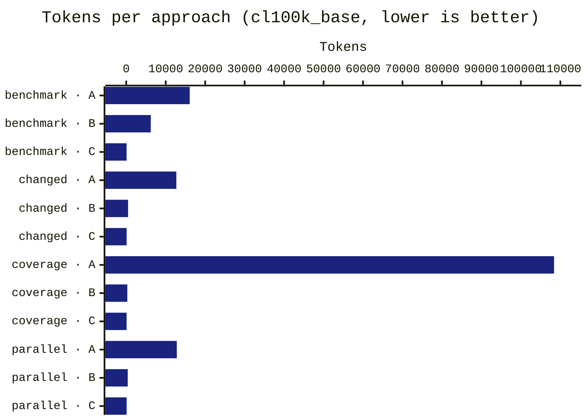
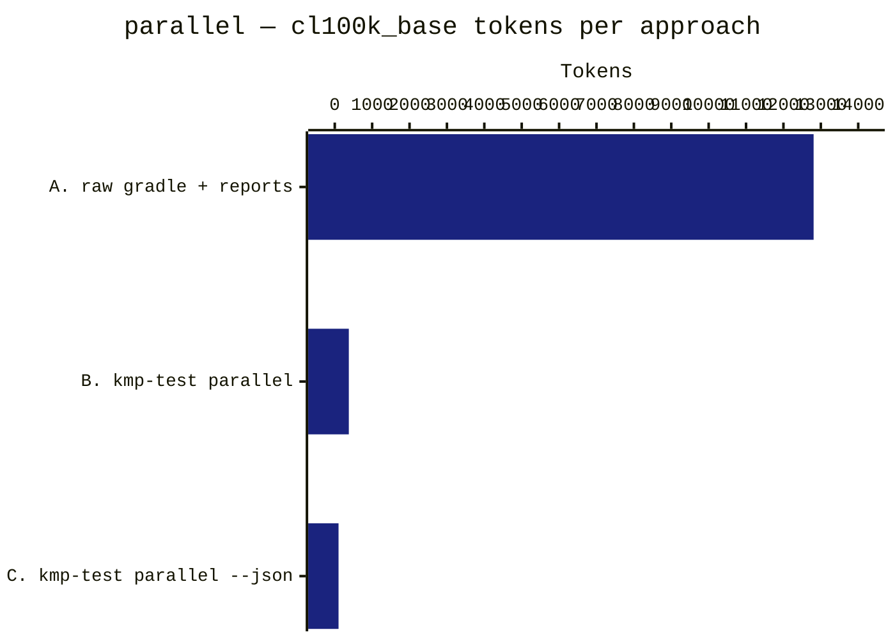
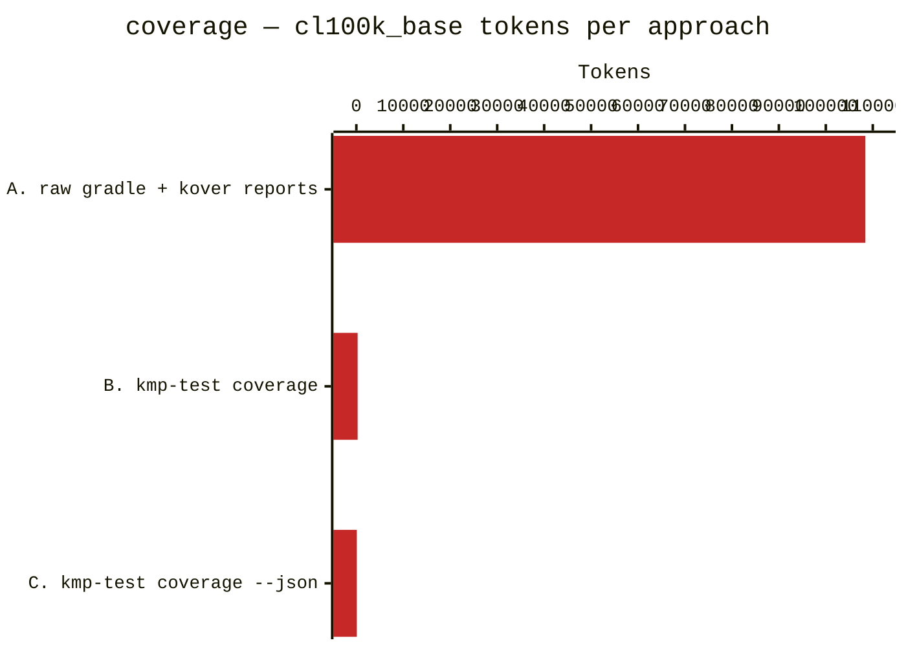
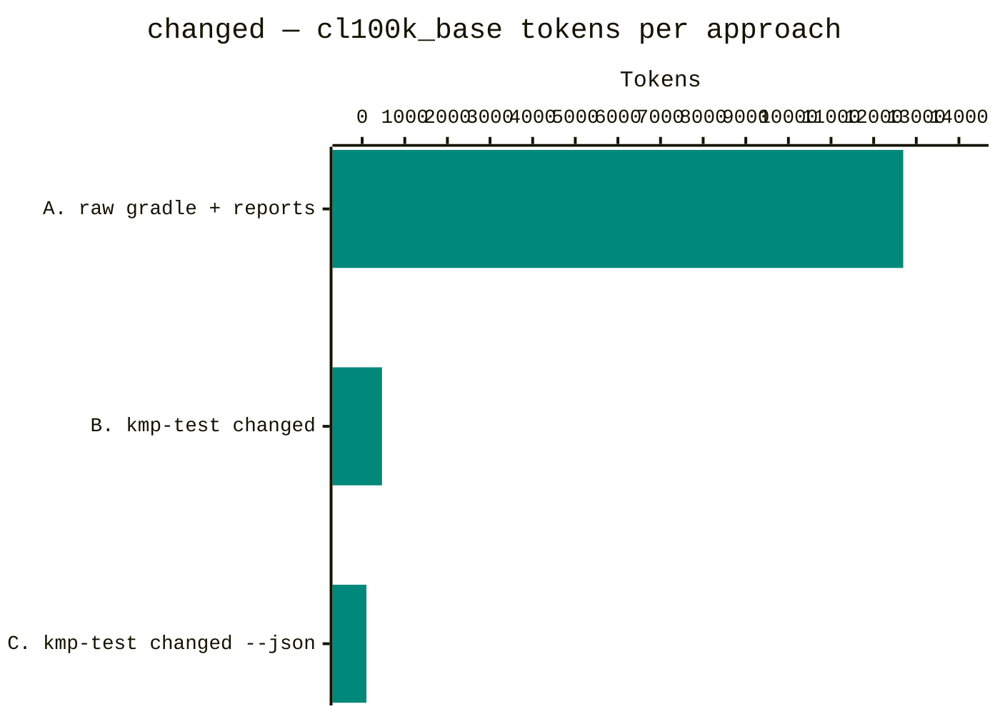
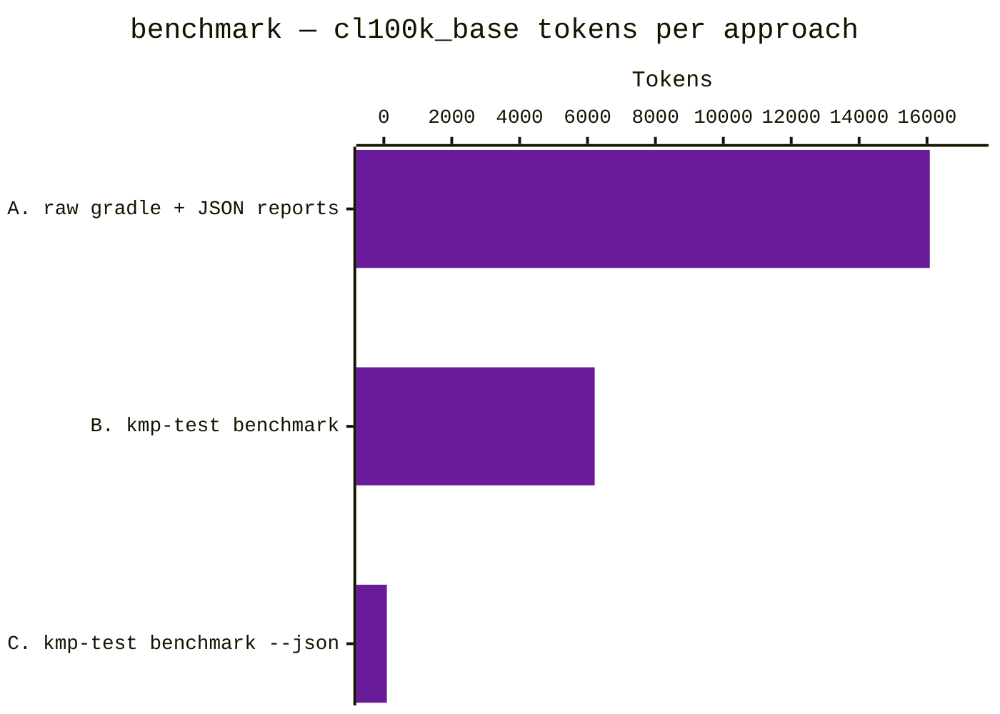

# Token-cost measurement

Empirical measurement of the token cost an AI agent pays to run a KMP
workflow in three different ways, across four kmp-test features.
Backs the qualitative claim in the README "Why this exists" section
with real numbers from a real codebase.

## Cross-feature summary



| Feature      | A. Raw gradle + reports | B. kmp-test markdown | C. `--json` | A:C ratio | B:C ratio |
|--------------|------------------------:|---------------------:|------------:|----------:|----------:|
| `parallel`   |                  12,807 |                  376 |         101 |     127× |     3.7× |
| `coverage`   |             **108,405** |                  273 |          89 |  **1218×** |     3.1× |
| `changed`    |                  12,694 |                  466 |         100 |     127× |     4.7× |
| `benchmark`  |                  16,083 |                6,211 |          89 |     181× | **70×**  |

Three patterns hold across every feature:

1. **C is consistently 89–101 tokens.** The `--json` envelope strips the
   feature down to `{exit_code, tests, modules, errors[]}` regardless of
   how heavy the underlying gradle workload is.
2. **A always exceeds 12 K tokens.** Raw gradle stdout alone is verbose;
   the report files multiply it. `coverage` is an outlier (108 K) because
   Kover HTML reports include per-line annotated source pages.
3. **B's variance comes from how rich the per-feature markdown report is.**
   Tiny on parallel/coverage/changed (273–466 tokens), heavy on
   benchmark (6,211) because the markdown report inlines per-benchmark
   scores by design — useful for humans, expensive for agents.

## Per-feature breakdown

### `parallel` — full test suite



Cross-tokenizer (`tools/runs/cross-model-results-parallel.txt` — captured against the v0.3.9 parallel measurement):

| Tokenizer            | A. Raw gradle + reports | B. kmp-test parallel | C. kmp-test --json | A vs C  |
|----------------------|------------------------:|---------------------:|-------------------:|--------:|
| `cl100k_base`        |                  12,807 |                  376 |                101 |    127× |
| `claude-opus-4-7`    |              **25,780** |              **642** |            **187** | **138×**|
| `claude-sonnet-4-6`  |                  19,234 |                  444 |                125 |    154× |
| `claude-haiku-4-5`   |                  19,234 |                  444 |                125 |    154× |

Two notable findings carry across all features:
- **Tokenizer transition.** `claude-sonnet-4-6` and `claude-haiku-4-5` share the same tokenizer (identical counts to the unit). `claude-opus-4-7` ships a new tokenizer that produces 34–50% more tokens for the same input — most visibly on heavy XML/HTML report payloads (approach A).
- **Ratios survive.** Despite per-model spreads of 70–101% in absolute count, the A:B:C ratio sits in a 127×–154× / 3.4×–3.7× band across all four tokenizers.

Captures: [`tools/runs/parallel/`](../tools/runs/parallel/).

### `coverage` — Kover XML + HTML reports



| Approach | Tokens | Bytes   | Duration | vs C   |
|----------|-------:|--------:|---------:|-------:|
| A raw    | 108,405 | 261,594 |     43s  | 1218×  |
| B md     |    273  |   1,524 |     20s  |   3.1× |
| C json   |     89  |     296 |     23s  |   1.0× |

The largest savings of any feature. Kover HTML reports include a fully
annotated source page per file (line numbers, hit counts, branch summaries,
package indexes) — slurping `build/reports/kover/**` for a single module
gives the agent ~261 KB of HTML it has to scan to find one number.

Cross-tokenizer ([`tools/runs/cross-model-results-coverage.txt`](../tools/runs/cross-model-results-coverage.txt)):

| Tokenizer            | A. Raw gradle + kover  | B. kmp-test coverage | C. kmp-test --json | A vs C  |
|----------------------|-----------------------:|---------------------:|-------------------:|--------:|
| `cl100k_base`        |            **108,405** |              **273** |             **89** | **1218×** |
| `claude-opus-4-7`    |                123,845 |                  482 |                162 |    765× |
| `claude-sonnet-4-6`  |                 92,940 |                  317 |                109 |    853× |
| `claude-haiku-4-5`   |                 92,940 |                  317 |                109 |    853× |

Captures: [`tools/runs/coverage/`](../tools/runs/coverage/).

### `changed` — tests for modules touched since `HEAD~1`



| Approach | Tokens | Bytes  | Duration | vs C   |
|----------|-------:|-------:|---------:|-------:|
| A raw    | 12,694 | 53,719 |      2s  | 127×   |
| B md     |    466 |  2,382 |     42s  |   4.7× |
| C json   |    100 |    342 |     33s  |   1.0× |

Wall-clock note: B/C take 33–42s vs A's 2s because `kmp-test changed`
delegates to the full parallel coverage suite (broader test selection),
while A only invokes the single `:module:desktopTest` task an agent
without `kmp-test` would naturally type. The token-cost ratio is the
headline — B/C deliver more thorough testing in 100–466 tokens vs A's
12,694.

Cross-tokenizer ([`tools/runs/cross-model-results-changed.txt`](../tools/runs/cross-model-results-changed.txt)):

| Tokenizer            | A. Raw gradle + reports | B. kmp-test changed | C. kmp-test --json | A vs C  |
|----------------------|------------------------:|--------------------:|-------------------:|--------:|
| `cl100k_base`        |                  12,694 |                 466 |                100 |    127× |
| `claude-opus-4-7`    |              **25,580** |             **787** |            **186** | **138×** |
| `claude-sonnet-4-6`  |                  19,098 |                 550 |                125 |    153× |
| `claude-haiku-4-5`   |                  19,098 |                 550 |                125 |    153× |

Captures: [`tools/runs/changed/`](../tools/runs/changed/).

### `benchmark` — JMH `desktopSmokeBenchmark`



| Approach | Tokens | Bytes  | Duration | vs C   |
|----------|-------:|-------:|---------:|-------:|
| A raw    | 16,083 | 52,651 |     99s  | 181×   |
| B md     |  6,211 | 20,648 |     77s  |   70×  |
| C json   |     89 |    297 |     75s  |   1.0× |

Largest B:C gap of any feature (70×). The markdown report keeps
per-benchmark scores by design — useful when a human is reading the
output to decide if a regression is real, expensive when the agent
just wants a pass/fail signal. If you need the scores, use B; if you
only need to know whether benchmarks regressed, C is 70× cheaper.

Cross-tokenizer ([`tools/runs/cross-model-results-benchmark.txt`](../tools/runs/cross-model-results-benchmark.txt)):

| Tokenizer            | A. Raw gradle + JSON   | B. kmp-test benchmark | C. kmp-test --json | A vs C |
|----------------------|-----------------------:|----------------------:|-------------------:|-------:|
| `cl100k_base`        |                 16,083 |                 6,211 |                 89 |   181× |
| `claude-opus-4-7`    |             **23,527** |             **9,916** |            **163** |  144×  |
| `claude-sonnet-4-6`  |                 19,266 |                 7,596 |                109 |   177× |
| `claude-haiku-4-5`   |                 19,266 |                 7,596 |                109 |   177× |

Captures: [`tools/runs/benchmark/`](../tools/runs/benchmark/).

## Methodology

- **Reference project**: [`shared-kmp-libs`](https://github.com/oscardlfr/shared-kmp-libs) — real production KMP library, ~80 modules, JDK 21.
- **Per-feature scope** (one module each, kept consistent across measurements):
    - `parallel`, `coverage`, `changed` → `core-result` (4 unit-test files, KMP `desktopTest` target).
    - `benchmark` → `benchmark-crypto` (kotlinx-benchmark `desktopSmokeBenchmark` config: 3 warmups × 3 iterations × 500 ms).
- **Tokenizer**: `cl100k_base` via [`js-tiktoken`](https://www.npmjs.com/package/js-tiktoken) for the baseline numbers above. Anthropic's [`messages.countTokens`](https://docs.anthropic.com/en/api/messages-count-tokens) API for cross-model validation per Claude 4.x model — that endpoint is free of charge (rate-limited only) and returns the exact `input_tokens` count those models would charge for. Per-feature evidence files in `tools/runs/cross-model-results-<feature>.txt`.
- **`changed` setup**: a synthetic uncommitted change is applied to the target module so both approaches see the same git diff. The script then calls `git diff --name-only HEAD` (override via `--changed-range <rev>`) to detect modules; the bash CLI uses `git status --porcelain`. Both resolve to the same module set for tracked-file edits.
- **`benchmark` JDK**: `shared-kmp-libs/benchmark-*` modules require JDK 21 (the convention plugin sets `jvmTarget = JVM_21`). Run with `JAVA_HOME=<jdk-21>` or the JmhBytecodeGeneratorWorker fails with a class file version mismatch.
- **Date**: 2026-04-26. **Tool version**: kmp-test-runner v0.3.8 (multi-feature measurement added in v0.4.0).
- **Runs per approach**: 1. The script supports `--runs N` for noise robustness; with the Gradle daemon hot the variance run-to-run is small.

## Captured outputs

The `tools/runs/` directory contains the actual stdout captured for each
approach (committed alongside this doc, one subdirectory per feature):

```
tools/runs/
├── parallel/
│   ├── A-run1.txt    # ./gradlew :core-result:desktopTest + reports walk
│   ├── B-run1.txt    # kmp-test parallel --module-filter core-result
│   └── C-run1.txt    # kmp-test parallel --json --module-filter core-result
├── coverage/
│   ├── A-run1.txt    # ./gradlew :core-result:koverXml/HtmlReport + reports walk
│   ├── B-run1.txt    # kmp-test coverage
│   └── C-run1.txt    # kmp-test coverage --json
├── changed/
│   ├── A-run1.txt    # ./gradlew :core-result:desktopTest + reports walk
│   ├── B-run1.txt    # kmp-test changed
│   └── C-run1.txt    # kmp-test changed --json
├── benchmark/
│   ├── A-run1.txt    # ./gradlew :benchmark-crypto:desktopSmokeBenchmark + JSON reports
│   ├── B-run1.txt    # kmp-test benchmark
│   └── C-run1.txt    # kmp-test benchmark --json
├── cross-model-results-parallel.txt    # per-tokenizer run (Anthropic countTokens)
├── cross-model-results-coverage.txt
├── cross-model-results-changed.txt
└── cross-model-results-benchmark.txt
```

## Reproducibility

Per-feature capture (writes `tools/runs/<feature>/{A,B,C}-run1.txt`):

```bash
# parallel — full test suite
node tools/measure-token-cost.js --feature parallel \
  --project-root /path/to/shared-kmp-libs \
  --module-filter "core-result" \
  --test-task desktopTest

# coverage — Kover XML + HTML reports
node tools/measure-token-cost.js --feature coverage \
  --project-root /path/to/shared-kmp-libs \
  --module-filter "core-result"

# changed — modules touched since HEAD~1 (or override --changed-range)
node tools/measure-token-cost.js --feature changed \
  --project-root /path/to/shared-kmp-libs \
  --test-task desktopTest \
  --changed-range HEAD       # use working-tree changes, like the CLI does

# benchmark — JMH desktop smoke config
JAVA_HOME=/path/to/jdk-21 node tools/measure-token-cost.js --feature benchmark \
  --project-root /path/to/shared-kmp-libs \
  --module-filter "benchmark-crypto" \
  --benchmark-task desktopSmokeBenchmark
```

Cross-model re-tokenize (per feature; reads existing captures from
`tools/runs/<feature>/`):

```bash
ANTHROPIC_API_KEY=sk-ant-... node tools/measure-token-cost.js \
  --feature <name> \
  --anthropic-models claude-opus-4-7,claude-sonnet-4-6,claude-haiku-4-5 \
  > tools/runs/cross-model-results-<name>.txt
```

## What this means in practice

Per agent iteration the absolute token saving is feature-specific:

| Feature    | A→C absolute saving (cl100k_base) | 5-iteration loop saving |
|------------|----------------------------------:|------------------------:|
| `parallel`  |                            12,706 |                  ~64 K |
| `coverage`  |                       **108,316** |             **~542 K** |
| `changed`   |                            12,594 |                  ~63 K |
| `benchmark` |                            15,994 |                  ~80 K |

A 5-iteration coverage loop on raw gradle burns ~542 K tokens — more
than two full 200 K Claude contexts. The same loop on `--json` burns ~500
tokens. **Context window pressure** is the real story, not the dollar
cost: the agent's working memory stays focused on the code instead of
log noise.

## Caveats

- **Tokenizer drift, validated.** `cl100k_base` is OpenAI's; Claude's tokenizer differs and isn't even consistent within the 4.x family (`claude-opus-4-7` ships a new tokenizer that's 34–50% less compact than the one shared by `sonnet-4-6` / `haiku-4-5`). The *ratio* between approaches (127×–1218× for A vs C) is robust across all four tokenizers measured for the parallel feature; per-feature cross-model evidence files cover the other three.
- **Project size matters.** A larger module set explodes A's cost faster than B/C (more `> Task` lines, more report files). Re-running on `DawSync`/`WakeTheCave`-scale projects would show even larger ratios. The current measurement is a conservative single-module baseline.
- **Failure shape matters.** A real test assertion failure with a long stack trace would inflate all three approaches, but A would inflate the most (the full trace lands in `build/test-results/*.xml`).
- **`coverage` ratio is an upper bound on a small module.** The 1218× number comes from comparing 108 K tokens of Kover HTML against an 89-token JSON envelope. On a multi-module aggregate (10+ modules under `--module-filter`) the absolute A grows linearly while C stays at ~89 tokens — the ratio grows further, not shrinks.
- **`benchmark` B is intentionally heavy.** The markdown report inlines per-benchmark scores so a human reviewer can see what regressed. Agents that only need a pass/fail should use C.
- **Single run.** Re-run with `--runs 3` (or higher) for mean ± std numbers if precision matters for your context.
