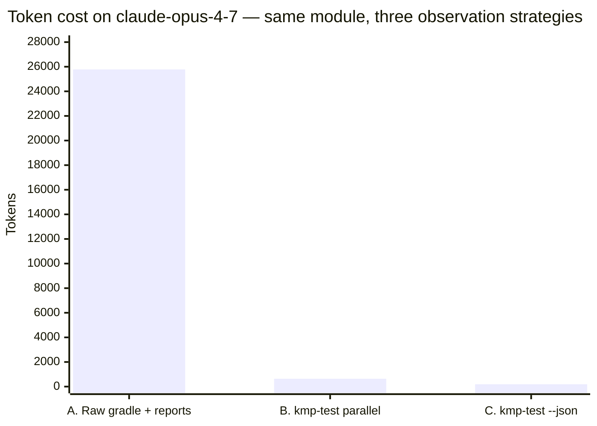

# Token-cost measurement

Empirical measurement of the token cost an AI agent pays to run a KMP test
suite in three different ways. Backs the qualitative claim in the README
"Agentic usage" section with a real number from a real codebase.



| Tokenizer            | A. Raw gradle + reports | B. kmp-test parallel | C. kmp-test --json | A vs C  |
|----------------------|------------------------:|---------------------:|-------------------:|--------:|
| `cl100k_base`        |                  12,807 |                  376 |                101 |    127× |
| `claude-opus-4-7`    |              **25,780** |              **642** |            **187** | **138×**|
| `claude-sonnet-4-6`  |                  19,234 |                  444 |                125 |    154× |
| `claude-haiku-4-5`   |                  19,234 |                  444 |                125 |    154× |

The chart above uses `claude-opus-4-7` (the largest of the family). A:B:C
ratio holds in a tight 127×–154× / 3.4×–3.7× band across cl100k_base +
Claude 4.x — absolute counts vary by up to ±100%, the relative order
doesn't.

## TL;DR

For the same test failure on the same module (cl100k_base baseline):

| Approach | Tokens | Bytes | vs `--json` |
|---|---:|---:|---:|
| **A.** Raw `./gradlew :module:desktopTest` + read `build/reports/**` | **12,807** | 54 KB | **127×** |
| **B.** `kmp-test parallel` (default markdown) | **376** | 2.0 KB | **3.7×** |
| **C.** `kmp-test parallel --json` | **101** | 343 B | **1.0×** |

`--json` mode delivers the same actionable failure information (exit code,
test counts, failure message) at ~1% of the raw-gradle-plus-reports cost.

## Cross-model validation

The same captures re-tokenised through Anthropic's
[`messages.countTokens`](https://docs.anthropic.com/en/api/messages-count-tokens)
API per Claude 4.x model — full numbers are at the [top of this doc](#token-cost-measurement); this section focuses on what the cross-model run *teaches*.

Two notable findings:

- **Tokenizer transition.** `claude-sonnet-4-6` and `claude-haiku-4-5` share
  the same tokenizer (identical counts to the unit). `claude-opus-4-7` ships
  a new tokenizer that produces 34–50% more tokens for the same input — most
  visibly on heavy XML/HTML report payloads (approach A).
- **Ratios survive.** Despite per-model spreads of 70–101% in absolute count,
  the A:B:C ratio sits in a 127×–154× / 3.4×–3.7× band across all four
  tokenizers. The "raw gradle is two orders of magnitude more expensive than
  `--json`" claim holds regardless of which Claude tokenizer the agent runs
  on.

Captured run output: [`tools/runs/cross-model-results.txt`](../tools/runs/cross-model-results.txt).
Reproduce with:

```bash
ANTHROPIC_API_KEY=sk-ant-… \
  node tools/measure-token-cost.js \
  --anthropic-models claude-opus-4-7,claude-sonnet-4-6,claude-haiku-4-5
```

## Methodology

- **Project**: `shared-kmp-libs` (real production KMP library; 68 modules).
- **Scope**: single module `core-result` with 4 unit test files (KMP
  desktopTest target). Failure reproduces because the JDK on the measurement
  machine targets a runtime older than the compile target —
  `UnsupportedClassVersionError`. The failure shape is irrelevant; what
  matters is each approach's report cost.
- **Tokenizer**: `cl100k_base` via `js-tiktoken` for the baseline above.
  Anthropic's `messages.countTokens` API is also exercised against the same
  captures (see [Cross-model validation](#cross-model-validation)) — the
  ratio between approaches is what backs the README claim, and that ratio
  is preserved across tokenizers.
- **Date**: 2026-04-26.
- **Tool version**: kmp-test-runner v0.3.8 (cross-model validation added in
  v0.3.9 against the same captures).
- **Runs per approach**: 1. The script supports `--runs N` for noise
  robustness, but with the Gradle daemon hot the variance run-to-run is
  small. Re-run the script if you want N>1 numbers.

## Captured outputs

The `tools/runs/` directory contains the actual stdout captured for each
approach (committed alongside this doc):

- `A-raw_gradle_report_parsing-run1.txt` — what an agent would see invoking
  `./gradlew :core-result:desktopTest --console=plain` and then reading
  every `*/build/reports/tests/test/*.html` and `*/build/test-results/test/*.xml`
  (matched against the same module filter).
- `B-kmp_test_parallel_markdown_-run1.txt` — `kmp-test parallel
  --module-filter core-result` stdout.
- `C-kmp_test_parallel_json-run1.txt` — `kmp-test parallel --json
  --module-filter core-result` stdout (single JSON line).

All three captured the same underlying test failure: `core-result` module's
`desktopTest` task failed with `UnsupportedClassVersionError`.

## Side-by-side: failure reporting

The README claim is that `--json` lets an agent act on the same information
the human-readable output conveys, at a fraction of the cost. To make that
concrete, here's the failure summary each mode emits:

**A. Raw gradle (showing only the relevant 4 lines out of 1,934 captured):**

```
> Task :core-result:desktopTest FAILED

ExecutionResultTest[desktop] > initializationError[desktop] FAILED
    java.lang.UnsupportedClassVersionError at ClassLoader.java:-2
```

…surrounded by ~100 lines of `> Task :core-result:foo UP-TO-DATE` progress
logs, plus the full HTML index of the test report and every JUnit XML in
`build/test-results/`. ~12.8K tokens total.

**B. `kmp-test parallel`:**

```
[FAIL] core-result :desktopTest — initializationError (UnsupportedClassVersionError)

Tests: 1 total | 0 passed | 1 failed | 0 skipped
BUILD FAILED — 1 module(s) failed
```

…inside a 50-line markdown-summarized run report. ~376 tokens.

**C. `kmp-test parallel --json`:**

```json
{"tool":"kmp-test","subcommand":"parallel","version":"0.3.7","project_root":"…","exit_code":1,"duration_ms":46680,"tests":{"total":1,"passed":0,"failed":1,"skipped":0},"modules":[],"coverage":{"tool":"auto","missed_lines":null},"errors":[{"message":"BUILD FAILED - 1 module(s) failed"}]}
```

One line. ~101 tokens (cl100k) / ~187 tokens (claude-opus-4-7). An agent can
`JSON.parse` this and branch on `exit_code` / `tests.failed` /
`errors[0].message`.

## What this means in practice

Per agent iteration the absolute token saving is 25,593 tokens (A → C, on
the claude-opus-4-7 tokenizer — the largest of the family). At Claude Opus
input pricing (~$15/MTok at the time of writing) that's roughly
$0.38/iteration in input cost on the test-running step alone. For a coding
loop that runs tests on every change — say 50× per session — that's
$19.20 per session of pure log-parsing tokens that the agent wastes when it
could be reasoning about the actual failure. Even on Sonnet pricing
(~$3/MTok) the gap is $3.84 per session. Numbers shrink on
sonnet-4-6 / haiku-4-5 (which share an older, more compact tokenizer) but
the ratio stays in the same band.

More importantly: **context window pressure**. A ~25 K-token observation
per loop iteration competes with the agent's actual working context. After
5 iterations the agent has spent ~128 K tokens just *reading test
reports* — that's the entire 200 K standard context burned on log
parsing. With `--json`, that drops to ~1 K tokens and the agent's
context stays focused on the code.

## Reproducibility

```bash
node tools/measure-token-cost.js \
  --project-root /path/to/kmp/project \
  --module-filter "<module-pattern>" \
  --test-task "<gradle-task-name>" \
  --runs 1
```

The exact command used for the numbers above:

```bash
node tools/measure-token-cost.js \
  --project-root C:/Users/34645/AndroidStudioProjects/shared-kmp-libs \
  --module-filter "core-result" \
  --test-task "desktopTest" \
  --runs 1
```

Outputs land in `tools/runs/`. The script counts tokens per file and prints
a markdown table on stdout — pipe it into a fresh copy of this doc to
refresh the table when re-measuring.

### Why `--test-task`?

KMP modules use `:module:desktopTest` / `:module:jvmTest` for JVM-side test
execution; plain Kotlin/JVM modules use `:module:test`. The script defaults
to `test` and accepts `--test-task` to override.

### Why not measure on `dipatternsdemo`?

Earlier attempts ran kmp-test against `dipatternsdemo` (43 modules, mixed
KMP+Android). Module discovery on a 43-module multi-target project hung
beyond a 10-minute timeout on Windows MinGW (filesystem walk overhead).
`shared-kmp-libs` has 68 modules but only one had to be in scope; with
`--module-filter "core-result"` discovery stayed fast enough.

## Caveats

- **Tokenizer drift, validated.** cl100k_base is OpenAI's; Claude's
  tokenizer differs and isn't even consistent within the 4.x family
  (`claude-opus-4-7` ships a new tokenizer that's 34–50% less compact than
  the one shared by `sonnet-4-6` / `haiku-4-5`). The *ratio* between
  approaches (127×–154× for A vs C, 3.4×–3.7× for B vs C) is robust across
  all four tokenizers measured — see
  [Cross-model validation](#cross-model-validation). Earlier versions of
  this doc claimed "within ±15% of cl100k_base"; the actual spread is
  closer to ±100% on heavy XML/HTML payloads, but the *ratio claim* held.
- **Project size matters.** A larger module set explodes A's cost faster
  than B/C (more `> Task` lines, more report files). Re-running on
  DawSync/WakeTheCave-scale projects would show even larger ratios. The
  current measurement is a conservative single-module baseline.
- **Failure shape matters.** The test failure here is a JDK mismatch
  (build-time, simple). A real test assertion failure with a long stack
  trace would inflate all three approaches, but A would inflate the most
  (the full trace lands in `build/test-results/*.xml`).
- **Single run.** Run the script with `--runs 3` (or higher) for
  mean ± std numbers if precision matters for your context.
