# Token-cost measurement

Empirical measurement of the token cost an AI agent pays to run a KMP
workflow in three different ways, across four `kmp-test` features.
Backs the qualitative claim in the README "Why this exists" section
with real numbers from a representative KMP SDK module.

## Cross-feature summary

Three bars per feature — A (raw gradle + reports), B (`kmp-test <feature>`),
C (`--json`). Lower is better.

```mermaid
%%{init: {'theme':'base','themeVariables':{'xyChart':{'backgroundColor':'transparent','plotColorPalette':'#5e35b1, #00897b, #fb8c00','titleColor':'#1a237e','xAxisLabelColor':'#212121','yAxisLabelColor':'#212121','xAxisTitleColor':'#212121','yAxisTitleColor':'#212121','xAxisLineColor':'#616161','yAxisLineColor':'#616161','xAxisTickColor':'#616161','yAxisTickColor':'#616161','titleFontSize':'18'},'fontFamily':'system-ui, -apple-system, Segoe UI, sans-serif','fontSize':'13px'}}}%%
xychart-beta
    title "Tokens per approach × feature (cl100k_base)"
    x-axis ["parallel", "coverage", "changed", "benchmark"]
    y-axis "Tokens" 0 --> 130000
    bar [12807, 108405, 12694, 16083]
    bar [376, 273, 466, 6211]
    bar [101, 89, 100, 89]
```



> 🟪 A (raw gradle + reports) · 🟩 B (kmp-test markdown) · 🟧 C (`--json`)

| Feature      | A. Raw gradle + reports | B. kmp-test markdown | C. `--json` | A:C ratio | B:C ratio |
|--------------|------------------------:|---------------------:|------------:|----------:|----------:|
| `parallel`   |                  12,807 |                  376 |         101 |     127× |     3.7× |
| `coverage`   |             **108,405** |                  273 |          89 |  **1218×** |     3.1× |
| `changed`    |                  12,694 |                  466 |         100 |     127× |     4.7× |
| `benchmark`  |                  16,083 |                6,211 |          89 |     181× | **70×**  |

Three patterns hold across every feature:

1. **C is consistently 89–101 tokens.** The `--json` envelope strips the
   feature down to `{exit_code, tests, modules, errors[]}` regardless of
   how heavy the underlying gradle workload is.
2. **A always exceeds 12 K tokens.** Raw gradle stdout alone is verbose;
   the report files multiply it. `coverage` is an outlier (108 K) because
   Kover HTML reports include per-line annotated source pages.
3. **B's variance comes from how rich the per-feature markdown report is.**
   Tiny on parallel/coverage/changed (273–466 tokens), heavy on
   benchmark (6,211) because the markdown report inlines per-benchmark
   scores by design — useful for humans, expensive for agents.

## Per-feature breakdown — same captures, four tokenizers

Each per-feature chart shows 4 bars per approach group (A / B / C). The
bars in each group are, left to right:
🟦 `cl100k_base` · 🟥 `claude-opus-4-7` · 🟩 `claude-sonnet-4-6` · 🟧 `claude-haiku-4-5`.

`cl100k_base` is OpenAI's tokenizer counted offline via
[`js-tiktoken`](https://www.npmjs.com/package/js-tiktoken); the three
Claude columns come from Anthropic's
[`messages.countTokens`](https://docs.anthropic.com/en/api/messages-count-tokens)
API on the same byte-for-byte capture (free of charge, rate-limited only).

### `parallel` — full test suite


| Tokenizer            | A. Raw gradle + reports | B. kmp-test parallel | C. kmp-test --json | A vs C  |
|----------------------|------------------------:|---------------------:|-------------------:|--------:|
| `cl100k_base`        |                  12,807 |                  376 |                101 |    127× |
| `claude-opus-4-7`    |              **25,780** |              **642** |            **187** | **138×**|
| `claude-sonnet-4-6`  |                  19,234 |                  444 |                125 |    154× |
| `claude-haiku-4-5`   |                  19,234 |                  444 |                125 |    154× |

Two observations carry across every feature:
- **Tokenizer transition.** `claude-sonnet-4-6` and `claude-haiku-4-5` share the same tokenizer (identical counts to the unit). `claude-opus-4-7` ships a new tokenizer that produces 30–100% more tokens for the same input — most visibly on heavy XML/HTML report payloads (approach A).
- **Ratios survive.** Despite per-model spreads of 70–101% in absolute count, the A:B:C ratio sits in a 127×–154× / 3.4×–3.7× band across all four tokenizers.

Captures: [`tools/runs/parallel/`](../tools/runs/parallel/) · evidence: [`tools/runs/cross-model-results-parallel.txt`](../tools/runs/cross-model-results-parallel.txt).

### `coverage` — Kover XML + HTML reports

```mermaid
%%{init: {'theme':'base','themeVariables':{'xyChart':{'backgroundColor':'transparent','plotColorPalette':'#3949ab, #e53935, #43a047, #fb8c00','titleColor':'#b71c1c','xAxisLabelColor':'#212121','yAxisLabelColor':'#212121','xAxisTitleColor':'#212121','yAxisTitleColor':'#212121','xAxisLineColor':'#616161','yAxisLineColor':'#616161','xAxisTickColor':'#616161','yAxisTickColor':'#616161','titleFontSize':'17'},'fontFamily':'system-ui, -apple-system, Segoe UI, sans-serif','fontSize':'13px'}}}%%
xychart-beta
    title "coverage — tokens per approach × tokenizer"
    x-axis ["A. raw gradle + kover", "B. kmp-test", "C. --json"]
    y-axis "Tokens" 0 --> 130000
    bar [108405, 273, 89]
    bar [123845, 482, 162]
    bar [92940, 317, 109]
    bar [92940, 317, 109]
```



| Tokenizer            | A. Raw gradle + kover  | B. kmp-test coverage | C. kmp-test --json | A vs C  |
|----------------------|-----------------------:|---------------------:|-------------------:|--------:|
| `cl100k_base`        |            **108,405** |              **273** |             **89** | **1218×** |
| `claude-opus-4-7`    |                123,845 |                  482 |                162 |    765× |
| `claude-sonnet-4-6`  |                 92,940 |                  317 |                109 |    853× |
| `claude-haiku-4-5`   |                 92,940 |                  317 |                109 |    853× |

The largest savings of any feature: A:C = **765×–1218×** across tokenizers.
Kover HTML reports include a fully annotated source page per file
(line numbers, hit counts, branch summaries, package indexes) — slurping
`build/reports/kover/**` for one module gives the agent ~261 KB of HTML
it has to scan to find one number.

Captures: [`tools/runs/coverage/`](../tools/runs/coverage/) · evidence: [`tools/runs/cross-model-results-coverage.txt`](../tools/runs/cross-model-results-coverage.txt).

### `changed` — tests for modules touched since `HEAD~1`

```mermaid
%%{init: {'theme':'base','themeVariables':{'xyChart':{'backgroundColor':'transparent','plotColorPalette':'#3949ab, #e53935, #43a047, #fb8c00','titleColor':'#004d40','xAxisLabelColor':'#212121','yAxisLabelColor':'#212121','xAxisTitleColor':'#212121','yAxisTitleColor':'#212121','xAxisLineColor':'#616161','yAxisLineColor':'#616161','xAxisTickColor':'#616161','yAxisTickColor':'#616161','titleFontSize':'17'},'fontFamily':'system-ui, -apple-system, Segoe UI, sans-serif','fontSize':'13px'}}}%%
xychart-beta
    title "changed — tokens per approach × tokenizer"
    x-axis ["A. raw gradle", "B. kmp-test", "C. --json"]
    y-axis "Tokens" 0 --> 27000
    bar [12694, 466, 100]
    bar [25580, 787, 186]
    bar [19098, 550, 125]
    bar [19098, 550, 125]
```



| Tokenizer            | A. Raw gradle + reports | B. kmp-test changed | C. kmp-test --json | A vs C  |
|----------------------|------------------------:|--------------------:|-------------------:|--------:|
| `cl100k_base`        |                  12,694 |                 466 |                100 |    127× |
| `claude-opus-4-7`    |              **25,580** |             **787** |            **186** | **138×** |
| `claude-sonnet-4-6`  |                  19,098 |                 550 |                125 |    153× |
| `claude-haiku-4-5`   |                  19,098 |                 550 |                125 |    153× |

Wall-clock note: B/C take 33–42s vs A's 2s because `kmp-test changed`
delegates to the full parallel coverage suite (broader test selection),
while A only invokes the single `:module:desktopTest` task an agent
without `kmp-test` would naturally type. The token-cost ratio is the
headline — B/C deliver more thorough testing in 100–466 tokens vs A's
12,694.

Captures: [`tools/runs/changed/`](../tools/runs/changed/) · evidence: [`tools/runs/cross-model-results-changed.txt`](../tools/runs/cross-model-results-changed.txt).

### `benchmark` — JMH `desktopSmokeBenchmark`

```mermaid
%%{init: {'theme':'base','themeVariables':{'xyChart':{'backgroundColor':'transparent','plotColorPalette':'#3949ab, #e53935, #43a047, #fb8c00','titleColor':'#e65100','xAxisLabelColor':'#212121','yAxisLabelColor':'#212121','xAxisTitleColor':'#212121','yAxisTitleColor':'#212121','xAxisLineColor':'#616161','yAxisLineColor':'#616161','xAxisTickColor':'#616161','yAxisTickColor':'#616161','titleFontSize':'17'},'fontFamily':'system-ui, -apple-system, Segoe UI, sans-serif','fontSize':'13px'}}}%%
xychart-beta
    title "benchmark — tokens per approach × tokenizer"
    x-axis ["A. raw gradle + JSON", "B. kmp-test", "C. --json"]
    y-axis "Tokens" 0 --> 25000
    bar [16083, 6211, 89]
    bar [23527, 9916, 163]
    bar [19266, 7596, 109]
    bar [19266, 7596, 109]
```



| Tokenizer            | A. Raw gradle + JSON   | B. kmp-test benchmark | C. kmp-test --json | A vs C |
|----------------------|-----------------------:|----------------------:|-------------------:|-------:|
| `cl100k_base`        |                 16,083 |                 6,211 |                 89 |   181× |
| `claude-opus-4-7`    |             **23,527** |             **9,916** |            **163** |  144×  |
| `claude-sonnet-4-6`  |                 19,266 |                 7,596 |                109 |   177× |
| `claude-haiku-4-5`   |                 19,266 |                 7,596 |                109 |   177× |

Largest B:C gap of any feature (60×–70×). The markdown report keeps
per-benchmark scores by design — useful when a human is reading the
output to decide if a regression is real, expensive when the agent
just wants a pass/fail signal. If you need the scores, use B; if you
only need to know whether benchmarks regressed, C is 70× cheaper.

Captures: [`tools/runs/benchmark/`](../tools/runs/benchmark/) · evidence: [`tools/runs/cross-model-results-benchmark.txt`](../tools/runs/cross-model-results-benchmark.txt).

## Methodology

- **Reference project**: a representative KMP SDK module (~80-module
  multi-target codebase, JDK 21). The captures committed under
  `tools/runs/` are byte-for-byte the actual output measured; project
  identity is not part of the methodology — any KMP project with similar
  module density would reproduce the ratios within the same band.
- **Per-feature scope** (one module each, kept consistent across measurements):
    - `parallel`, `coverage`, `changed` → a small Result/Either-style
      utility module (4 unit-test files, KMP `desktopTest` target).
    - `benchmark` → a kotlinx-benchmark module
      (`desktopSmokeBenchmark` config: 3 warmups × 3 iterations × 500 ms).
- **Tokenizer**: `cl100k_base` via [`js-tiktoken`](https://www.npmjs.com/package/js-tiktoken)
  for the baseline numbers above. Anthropic's
  [`messages.countTokens`](https://docs.anthropic.com/en/api/messages-count-tokens)
  API for cross-model validation per Claude 4.x model — that endpoint
  is free of charge (rate-limited only) and returns the exact
  `input_tokens` count those models would charge for. Per-feature
  evidence files in `tools/runs/cross-model-results-<feature>.txt`.
- **`changed` setup**: a synthetic uncommitted change is applied to the
  target module so both approaches see the same git diff. The script
  then calls `git diff --name-only HEAD` (override via
  `--changed-range <rev>`) to detect modules; the bash CLI uses
  `git status --porcelain`. Both resolve to the same module set for
  tracked-file edits.
- **`benchmark` JDK**: `kotlinx-benchmark` modules whose convention
  plugin sets `jvmTarget = JVM_21` require JDK 21 at build time. Run
  with `JAVA_HOME=<jdk-21>` or the JmhBytecodeGeneratorWorker fails
  with a class file version mismatch.
- **Date**: 2026-04-26. **Tool version**: kmp-test-runner v0.4.0
  (multi-feature measurement; v0.3.9 introduced cross-model validation
  for the parallel feature).
- **Runs per approach**: 1. The script supports `--runs N` for noise
  robustness; with the Gradle daemon hot the variance run-to-run is
  small.

## Captured outputs

The `tools/runs/` directory contains the actual stdout captured for each
approach (committed alongside this doc, one subdirectory per feature):

```
tools/runs/
├── parallel/
│   ├── A-run1.txt    # ./gradlew :<module>:desktopTest + reports walk
│   ├── B-run1.txt    # kmp-test parallel --module-filter <module>
│   └── C-run1.txt    # kmp-test parallel --json --module-filter <module>
├── coverage/
│   ├── A-run1.txt    # ./gradlew :<module>:koverXml/HtmlReport + reports walk
│   ├── B-run1.txt    # kmp-test coverage
│   └── C-run1.txt    # kmp-test coverage --json
├── changed/
│   ├── A-run1.txt    # ./gradlew :<module>:desktopTest + reports walk
│   ├── B-run1.txt    # kmp-test changed
│   └── C-run1.txt    # kmp-test changed --json
├── benchmark/
│   ├── A-run1.txt    # ./gradlew :<bench>:desktopSmokeBenchmark + JSON reports
│   ├── B-run1.txt    # kmp-test benchmark
│   └── C-run1.txt    # kmp-test benchmark --json
├── cross-model-results-parallel.txt    # per-tokenizer run (Anthropic countTokens)
├── cross-model-results-coverage.txt
├── cross-model-results-changed.txt
└── cross-model-results-benchmark.txt
```

## Reproducibility

Per-feature capture (writes `tools/runs/<feature>/{A,B,C}-run1.txt`) —
substitute your own KMP project root + module names:

```bash
# parallel — full test suite
node tools/measure-token-cost.js --feature parallel \
  --project-root /path/to/your/kmp/project \
  --module-filter "<your-module>" \
  --test-task desktopTest

# coverage — Kover XML + HTML reports
node tools/measure-token-cost.js --feature coverage \
  --project-root /path/to/your/kmp/project \
  --module-filter "<your-module>"

# changed — modules touched since HEAD~1 (or override --changed-range)
node tools/measure-token-cost.js --feature changed \
  --project-root /path/to/your/kmp/project \
  --test-task desktopTest \
  --changed-range HEAD       # use working-tree changes, like the CLI does

# benchmark — JMH desktop smoke config (kotlinx-benchmark on JDK 21+)
JAVA_HOME=/path/to/jdk-21 node tools/measure-token-cost.js --feature benchmark \
  --project-root /path/to/your/kmp/project \
  --module-filter "<your-bench-module>" \
  --benchmark-task desktopSmokeBenchmark
```

Cross-model re-tokenize (per feature; reads existing captures from
`tools/runs/<feature>/`):

```bash
ANTHROPIC_API_KEY=sk-ant-... node tools/measure-token-cost.js \
  --feature <name> \
  --anthropic-models claude-opus-4-7,claude-sonnet-4-6,claude-haiku-4-5 \
  > tools/runs/cross-model-results-<name>.txt
```

## What this means in practice

Per agent iteration the absolute token saving is feature-specific:

| Feature    | A→C absolute saving (cl100k_base) | 5-iteration loop saving |
|------------|----------------------------------:|------------------------:|
| `parallel`  |                            12,706 |                  ~64 K |
| `coverage`  |                       **108,316** |             **~542 K** |
| `changed`   |                            12,594 |                  ~63 K |
| `benchmark` |                            15,994 |                  ~80 K |

A 5-iteration coverage loop on raw gradle burns ~542 K tokens — more
than two full 200 K Claude contexts. The same loop on `--json` burns
~500 tokens. **Context window pressure** is the real story, not the
dollar cost: the agent's working memory stays focused on the code
instead of log noise.

## Caveats

- **Tokenizer drift, validated.** `cl100k_base` is OpenAI's; Claude's
  tokenizer differs and isn't even consistent within the 4.x family
  (`claude-opus-4-7` ships a new tokenizer that's 34–50% less compact
  than the one shared by `sonnet-4-6` / `haiku-4-5`). The *ratio*
  between approaches (127× to 1218× for A vs C, depending on feature)
  is robust across all four tokenizers measured per feature.
- **Project size matters.** A larger module set explodes A's cost
  faster than B/C (more `> Task` lines, more report files). Re-running
  on a 100+-module aggregate would show even larger ratios. The current
  measurement is a conservative single-module baseline.
- **Failure shape matters.** A real test assertion failure with a long
  stack trace would inflate all three approaches, but A would inflate
  the most (the full trace lands in `build/test-results/*.xml`).
- **`coverage` ratio is an upper bound on a small module.** The 1218×
  number comes from comparing 108 K tokens of Kover HTML against an
  89-token JSON envelope. On a multi-module aggregate (10+ modules
  under `--module-filter`) the absolute A grows linearly while C stays
  at ~89 tokens — the ratio grows further, not shrinks.
- **`benchmark` B is intentionally heavy.** The markdown report inlines
  per-benchmark scores so a human reviewer can see what regressed.
  Agents that only need a pass/fail should use C.
- **Single run.** Re-run with `--runs 3` (or higher) for mean ± std
  numbers if precision matters for your context.
