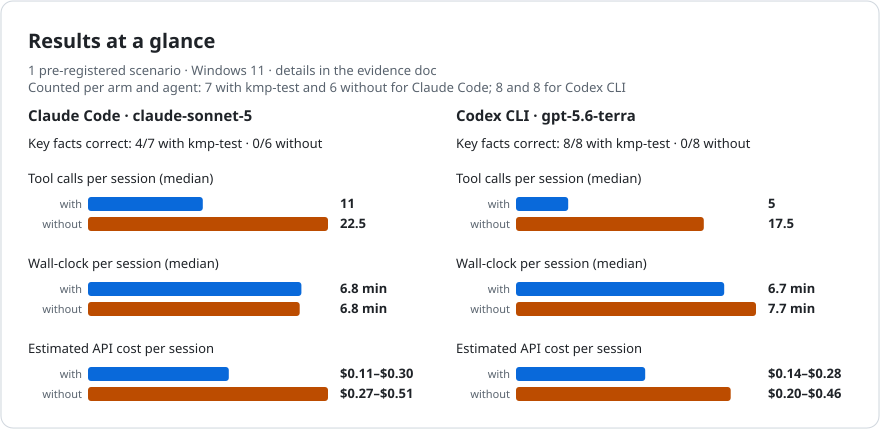
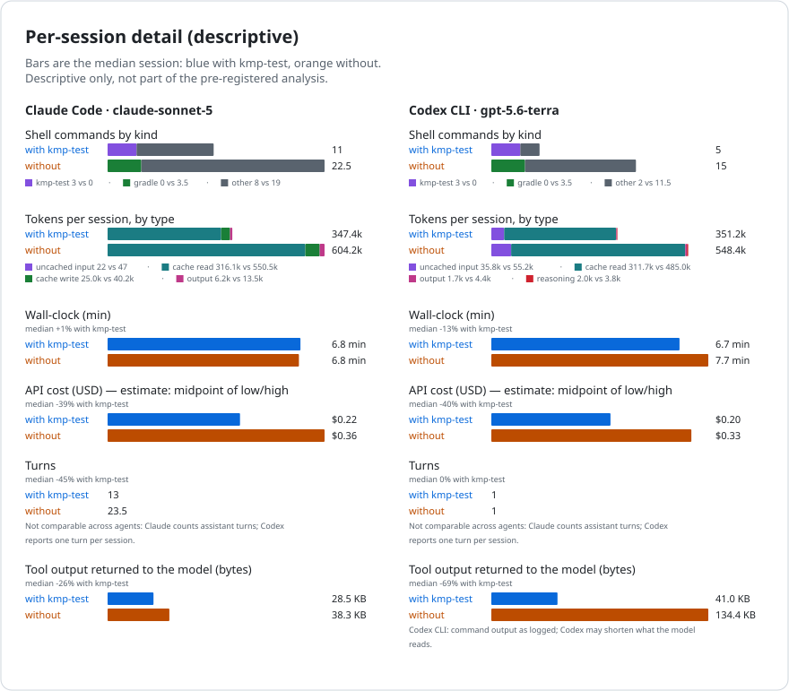
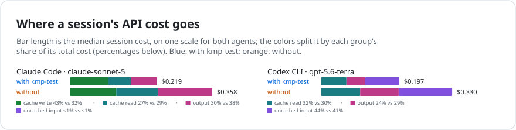

# Evidence5: changed modules and dependents in NowInAndroid

The frozen revised4 Evidence5 campaign ran on 2026-10-08. A committed one-line edit in `:core:network` leaves its own tests passing but causes one test method in dependent `:core:data` to fail. Agents were asked to compare against a pinned base, include direct and transitive project dependents, run the selected host tests, and report the dependency chain and failure. The product arm had `kmp-test` and its Agent Skill; the free arm used Gradle without them.

**Scope:** one pinned NowInAndroid checkout, one Windows VM, two agent runtimes and one scenario. These descriptive results do not establish a general or causal product effect.

## Result

| Runtime | Arm | Scheduled | Counted | Correct key facts | Product protocol success |
|---|---|---:|---:|---:|---:|
| Claude Code (`claude-sonnet-5`) | with kmp-test | 8 | 7 | 4/7 | 0/7 |
| Claude Code (`claude-sonnet-5`) | without | 8 | 6 | 0/6 | not applicable |
| Codex CLI (`gpt-5.6-terra`) | with kmp-test | 8 | 8 | 8/8 | 3/8 |
| Codex CLI (`gpt-5.6-terra`) | without | 8 | 8 | 0/8 | not applicable |

There were **32 scheduled positions, 29 accepted records and three missing Claude positions** (free indices 13 and 14; product index 15). Each missing run ended before inference with a terminal error, zero tool use and explicit zero runtime-reported token usage. They contribute neither numerator nor score denominator, and none was replayed. The original last-block broker promotion verdict was `FAIL/runtime_ineligible` with only four Codex cells promoted, because Claude had rejections. The separate preregistered structural gate validated the one accepted Claude pair in that block and retained the three original rejection diagnostics. The infra-only sensitivity analysis excluded zero cells and matches the primary result.

The ground truth has 19 selected modules: changed `:core:network` plus 18 graph dependents. Four are excluded by `--exclude-modules`, and `:benchmarks` has no host test source set, leaving 14 dispatched modules, 62 individual tests and one distinct failing method, `NetworkEntityTest.networkTopicMapsToExternalModel`, in `:core:data`. Key facts require the correct dependency and failure report. Product protocol success additionally requires authoritative current-run product evidence and the prescribed workflow; it is reported separately from factual correctness.

The [detailed benchmark document](../../../docs/agentic-benchmark.md#evidence5-2026-10-08-changed-modules-and-dependents) lists each counted session and component medians. Tool calls, turns and tool output have different meanings across runtimes; interpret comparisons within each runtime and this task.

## Design and provenance

- The revised4 protocol was frozen at 2026-10-08T08:05:23.477Z before primary inference, SHA-256 `4a48a721307c06de3e2d4a5255676d0565299808e219bd009f89941a27c1c768`. The [public protocol summary](preregistration.md) gives the scoring and stop rules. Earlier pilot and revised attempts are excluded and disclosed in the [attempt ledger](attempt-ledger.md).
- Four sequential eight-position blocks used IDs `515470b6-6c23-49e6-a867-cde7fd37383c`, `769ffa55-b582-4743-adb3-a433061c5a8b`, `4bbbe8a2-e345-43db-bedc-324b07970bee`, and `e5992aea-7010-4d0a-af97-c7af965fa1fa`. Their deterministic analysis-only merged ID is `830d4337-800f-8735-95cd-d51460a231cc`. The four-cell revised4 canary is excluded from scores.
- Runtime/source pin: kmp-test-runner `0.17.0` at protected `develop` commit `3e309437b726c32c84cc306e6c8a924a03492284`; skill source `39ea824e301022af57990cb6e30a2fb381ad6df2`; NowInAndroid `7d45eae4f8720a0c77f507712ba2437ff974b6ed`. Claude Code 2.1.238 and Codex CLI 0.154.0 used the pinned Sonnet 5 and Terra models at high effort.

## Cost and controls

The machine-readable [cost estimate](cost-estimate.json) prices the **29 counted** sessions at its stated list rates for the charts. The separately checked [cost control](cost-control.json) uses conservative long-context rates across **all 32 primary attempts**, including three explicit zero-use missing cells: **USD12.2237994**. Adding the excluded revised4 canary gives USD13.9602382 known revised4 attempt upper. The hypothetical USD25 unknown-use administrative reserve makes the frozen control total USD38.9602382, below its USD70 ceiling. The reserve is not observed spend; actual OAuth charges are unknown. Historical attempts are outside this ceiling and have two unknown-use cells.

All four blocks closed with the exact VM off, VHD detached and network offline. Independent audits verified original receipts, record/audit and rejection diagnostics, source/arm/order/run-ID pins, and SHA/byte parity for 93 merged private files including 4,186,544 transcript bytes. Access scan and infra classifier found zero flags across 32 positions. The [controls audit](controls-audit.md) details the original last-block eligibility verdict and custody limits. Raw transcripts, login material and complete operational preregistrations remain private.

## Limits

- One scenario, project, host and small unpowered groups limit generalization. The product arm changes CLI and Skill availability together, so the design does not isolate either component.
- Rejected-cell after-session state listings are unavailable. The three zero-use terminal errors are structurally missing, not counted factual failures or eligible for a score-based replay. The accepted Claude cell in the last block retains its matrix-level `benchmark_eligible:false` field; its record/audit pair is valid under the frozen individual-cell gate.
- Accepted Codex cells retain `agent_state_clean:false` due the declared narrow `config.toml` change under `--ignore-user-config`; no byte-identity claim for that file is made. Codex JUnit XML capture and actual OAuth charges were not independently verified.
- Product protocol success and correct key facts differ materially here. Medians are descriptive, not a significance test; other Evidence campaigns use different tasks and must not be pooled as if repeated trials of this scenario.
